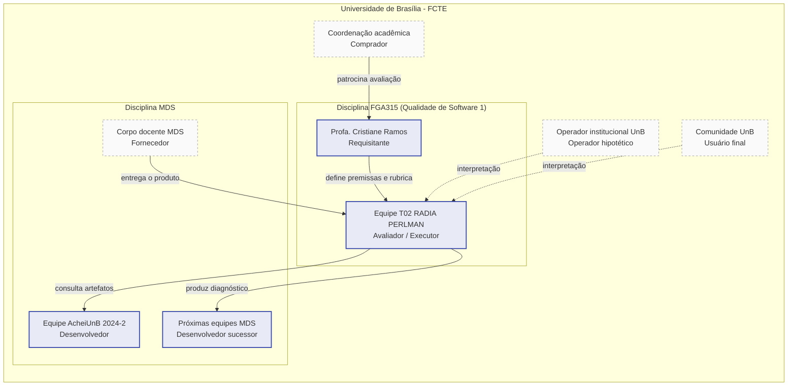

# 2. Requisitante e partes interessadas

A ISO/IEC 25040 estabelece que **os requisitos de avaliação derivam das necessidades dos
stakeholders**. Esta seção identifica o requisitante, mapeia as partes interessadas em
papéis (comprador, fornecedor, desenvolvedor, operador, usuário, avaliador) e explicita o
**critério de sucesso de cada uma** e a **influência real sobre escolhas** da avaliação,
em particular sobre a seleção de características ([§5](05-caracteristicas.md)) e sobre o
escopo ([§6](06-escopo.md)).

## 2.1 Requisitante da avaliação

| | |
|---|---|
| **Quem** | Profa. Cristiane Ramos, docente responsável pela disciplina **FGA315 Qualidade de Software 1**, FCTE/UnB. |
| **Figura institucional** | Requisitante acadêmica: define o problema (avaliação SQuaRE), aprova entregas, audita rastreabilidade git e atribui notas. |
| **Critério de sucesso** | Receber relatórios e artefatos auditáveis que demonstrem aplicação rigorosa do processo da ISO/IEC 25040 e adequação à rubrica da disciplina. |
| **Influência sobre a avaliação** | Define as **premissas obrigatórias** do projeto (2 a 4 características, exclusão de usabilidade, dados auditáveis, ODS, GitPage, *release*). Essas premissas estão refletidas em todo o desenho da avaliação. |

## 2.2 Mapa de partes interessadas

A tabela abaixo resume os stakeholders mapeados, com papel segundo a ISO/IEC 25040,
necessidade principal, critério de sucesso e como cada um influenciou escolhas concretas
desta Fase 1.

| Stakeholder | Papel (ISO/IEC 25040) | Necessidade principal | Critério de sucesso | Influência concreta nas escolhas da Fase 1 |
|---|---|---|---|---|
| **Profa. Cristiane Ramos** | Requisitante / Avaliador externo | Conduzir a avaliação acadêmica do trabalho da equipe T02. | Conformidade com a rubrica e com SQuaRE. | Fixou as **premissas obrigatórias** (ver §1) e a estrutura das entregas (EU1 a EU3). |
| **Equipe T02 RADIA PERLMAN (FGA315)** | Avaliador (executor) | Produzir uma avaliação tecnicamente defensável dentro do tempo da disciplina. | Atingir nível 3+ em todos os critérios da rubrica e entregar dentro do prazo. | Definiu o **método de priorização** das características (§5) e a **profundidade** do escopo (§6) compatíveis com a capacidade da equipe. |
| **Equipe AcheiUnB 2024-2 (atual / egressos)** | Desenvolvedor | Receber um diagnóstico independente do código que produziram. | Identificar dívidas técnicas concretas e itens corrigíveis a curto prazo. | Justificou a inclusão de **Manutenibilidade** como característica de alta prioridade (§5). |
| **Próximas equipes da disciplina MDS** | Desenvolvedor (sucessor) | Herdar o código com previsibilidade, isto é, saber o que mantém, refatora ou substitui. | Receber um *backlog* de qualidade ranqueado por risco. | Justificou a decisão D2 do propósito (§1) e a inclusão de **Adequação Funcional** e **Confiabilidade** (§5). |
| **Coordenação das disciplinas MDS e FGA315** | Comprador (no sentido SQuaRE: quem encomenda institucionalmente a avaliação) | Ter evidência empírica sobre projetos pedagógicos em engenharia de software. | Resultados publicáveis e reaproveitáveis em ciclos futuros. | Reforçou a publicação dos artefatos em GitPage aberta, e não apenas no Aprender 3. |
| **Hipotético operador institucional UnB** (ex.: SAA, segurança patrimonial, centros acadêmicos) | Operador | Operar a plataforma com confiabilidade aceitável em ambiente real. | Sistema com disponibilidade básica e baixo custo de operação. | Reforçou a inclusão de **Confiabilidade** e **Segurança** (§5). O stakeholder **não foi entrevistado**: sua presença é hipotética e influencia somente a interpretação dos resultados. |
| **Comunidade UnB (usuários finais)** | Usuário | Recuperar objetos perdidos e relatar achados de forma confiável e respeitosa à privacidade. | Plataforma funcional e segura nos dados pessoais. | Justifica a **Segurança** como prioridade alta (dados de localização e autenticação institucional) e o ODS 11 (§7). Usuários **não foram entrevistados** nesta fase. |
| **Disciplina MDS (corpo docente)** | Fornecedor (no sentido SQuaRE: quem entregou o produto avaliado) | Compreender em que medida o processo de ensino entrega artefatos com qualidade técnica esperada. | Diagnóstico que separe *gaps* de **produto** de *gaps* de **processo de ensino**. | Justifica a ênfase em métricas obteníveis por análise estática, independentes da equipe original, permitindo comparabilidade entre semestres em fases futuras. |

## 2.3 Diagrama de stakeholders

*Figura 2.1: mapa de stakeholders. Setas sólidas indicam relações ativas durante a
avaliação; setas tracejadas indicam relações de interpretação (stakeholders não
entrevistados, considerados apenas na leitura dos resultados).*

## 2.4 Mecanismos de envolvimento

| Stakeholder | Mecanismo de envolvimento previsto | Frequência |
|---|---|---|
| Profa. Cristiane Ramos | Entregas EU1, EU2, EU3 e revisão entre pares no Aprender 3. | Por entrega. |
| Equipe T02 | Reuniões internas, *issues* e *pull requests* no GitHub. | Semanal. |
| Equipe AcheiUnB 2024-2 | **Consulta documental** ao repositório e à documentação publicada (sem entrevista nesta fase). | - |
| Próximas equipes MDS | Recepção dos artefatos publicados (GitPage + *release*) após a Fase 4. | Pós-entrega. |
| Coordenação MDS/FGA315 | Acesso público à GitPage. | Contínuo. |
| Operador institucional / Comunidade UnB | **Não envolvidos diretamente** (interpretação dos resultados na Fase 4). | - |

!!! info "Decisão registrada: ausência de entrevistas na Fase 1"
    A Fase 1 **não conduz entrevistas** com a equipe AcheiUnB nem com usuários finais.
    A equipe T02 optou por basear a avaliação em **análise documental e técnica** do
    artefato (código, configuração e CI), sem coleta direta com stakeholders externos.
    Caso fases futuras venham a incluir entrevistas, os registros correspondentes serão
    publicados no próprio repositório.

## Histórico de versão

| Versão | Data       | Descrição                | Autor(es)                                 | Revisor(es)                          |
|--------|------------|--------------------------|-------------------------------------------|--------------------------------------|
| 1.0    | 2026-05-13 | Versão inicial da seção. | Letícia Hladczuk, Julia Vitória, Luis Lima | Davi Casseb, Ana Joyce, Samuel Afonso |

## Referências

1. ISO/IEC 25040:2011. *Systems and software engineering: Systems and software Quality Requirements and Evaluation (SQuaRE): Evaluation process*. International Organization for Standardization, 2011.
2. ISO/IEC 25010:2011. *Systems and software engineering: Systems and software Quality Requirements and Evaluation (SQuaRE): System and software quality models*. International Organization for Standardization, 2011.
3. RAMOS, Cristiane. *Plano de Ensino da disciplina FGA315 Qualidade de Software 1*. FCTE/UnB, 2026/1.
