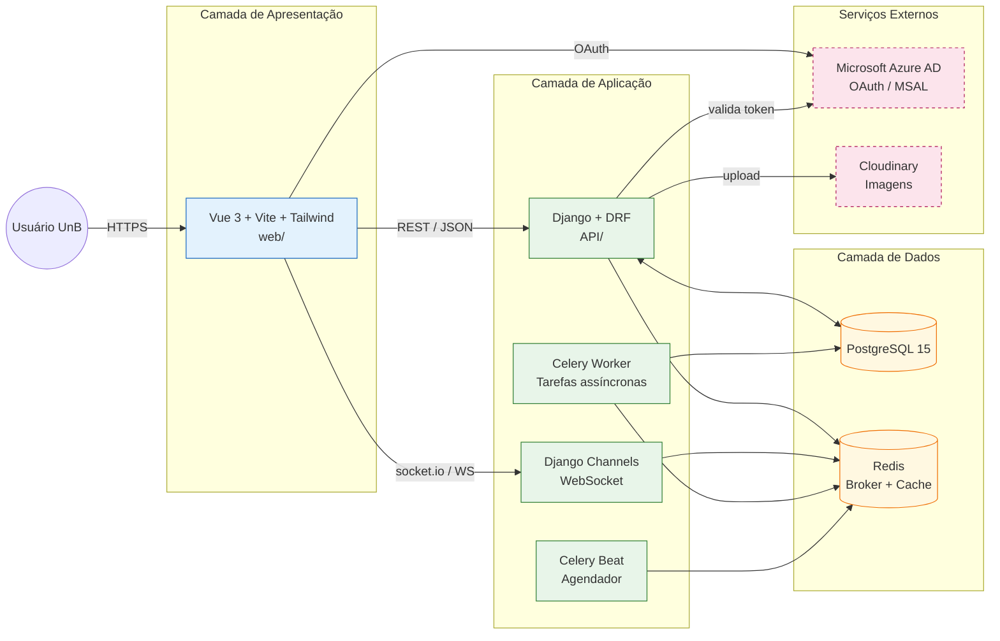

# 3. Tipo de produto e descrição do software

Esta seção classifica o **tipo de produto** avaliado, descreve o AcheiUnB de forma
estruturada (módulos, interfaces, dependências e restrições) e explicita o **impacto direto
dessas características sobre a avaliação** — em particular, o que é factível medir agora e
o que fica reservado para fases futuras.

## 3.1 Identificação do software

| Item | Conteúdo |
|---|---|
| Nome | AcheiUnB |
| Repositório | https://github.com/unb-mds/2024-2-AcheiUnB |
| Origem | Disciplina **Métodos de Desenvolvimento de Software (MDS)**, FCTE/UnB, semestre 2024/2. |
| Mantenedores históricos | Sete estudantes de graduação (Ana Elisa, Davi Camilo, Euller Júlio, Leonardo Ramiro, Pedro Everton, Pedro Henrique, Tiago Balieiro), conforme `README.md`. |
| Estado | MVP em desenvolvimento, sem instância de produção pública identificada. |
| Licença | Não declarada no repositório (será confirmado na Fase 2 e tratado como achado em Manutenibilidade caso permaneça ausente). |
| Propósito do software | Plataforma de **achados e perdidos** para a comunidade da Universidade de Brasília. Centraliza o registro de itens encontrados/perdidos e mediadia a comunicação entre quem perdeu e quem achou. |

## 3.2 Classificação do tipo de produto

Aplicando os referenciais da ISO/IEC 25010 (classificações de produto) e da ISO/IEC 25051
(produtos do tipo RUSP — *Ready to Use Software Product*), o AcheiUnB é classificado como:

- **Aplicação web SPA (*Single Page Application*) de uso geral**, do tipo **plataforma
  web institucional sem fins lucrativos**;
- **Sistema multiusuário com autenticação institucional federada** (Microsoft Azure AD via
  MSAL);
- **Produto sob desenvolvimento ativo (MVP)**, **não certificado** e **sem operação
  comercial**;
- **Sistema distribuído em camadas**, composto por *frontend* SPA, *backend* HTTP/REST,
  serviço de WebSocket, fila de tarefas assíncronas e banco de dados relacional, integrado
  a um provedor externo de armazenamento de mídia (Cloudinary) e a um provedor de
  identidade externo (Microsoft Azure AD).

!!! info "Implicação dessa classificação para a avaliação"
    Por **não** ser produto RUSP nem produto operacional em produção, o AcheiUnB **não
    expõe métricas de uso real** (volume de usuários, *throughput*, taxa de erro em
    operação). Portanto, características que dependem de **operação observada** (ex.:
    confiabilidade medida em ambiente real, ou eficiência de desempenho sob carga
    representativa) só podem ser avaliadas por **execução controlada em laboratório**.
    Essa restrição é registrada formalmente em [Escopo](06-escopo.md).

## 3.3 Arquitetura e módulos

### 3.3.1 Visão geral

O AcheiUnB segue uma arquitetura em **três camadas lógicas** com **serviços auxiliares**
desacoplados via fila e *broker* de mensagens. O *backend* é monolítico em Django,
particionado em módulos por domínio. O *frontend* é uma SPA Vue 3 que consome a API REST e
estabelece conexão WebSocket para o chat.

*Figura 3.1: diagrama de contexto e arquitetura do AcheiUnB. As caixas tracejadas
representam serviços externos fora do limite de controle da equipe AcheiUnB.*

### 3.3.2 Módulos do *backend*

O *backend* (`API/`) é organizado em *apps* Django por domínio:

| Módulo | Responsabilidade | Pontos relevantes para avaliação |
|---|---|---|
| `API/users/` | Cadastro, autenticação institucional (MSAL), gestão de sessão (JWT em *cookie* HttpOnly), perfis, *matching* automático de itens perdidos/achados. | Concentra fluxos críticos de **Segurança** (auth, sessão) e regras de negócio centrais para **Adequação Funcional** (matching). |
| `API/chat/` | Mensageria em tempo real entre usuários por meio de Django Channels (WebSocket). | Único módulo com comunicação assíncrona bidirecional; relevante para **Confiabilidade** (tolerância a falhas, recuperação de sessão WS). |
| `API/reports/` | Cadastro e gestão de denúncias e relatos de itens. | Fluxo CRUD típico; relevante para **Adequação Funcional**. |
| `API/support/` | Suporte / *helpdesk* básico. | Baixa criticidade; usado para amostragem em **Manutenibilidade** (padrões de código). |
| `API/websocket-server/` | Orquestração dos *consumers* WS e configuração do *channel layer*. | Relevante para **Confiabilidade** (tolerância a falhas no canal real-time). |
| `API/AcheiUnB/` | Projeto Django (settings, *urls*, *wsgi*/*asgi*). | Concentra **configuração de segurança** (CORS, `SECRET_KEY`, *middlewares*, *backends* de autenticação). |

### 3.3.3 Frontend

O *frontend* (`web/`) é uma SPA construída com **Vue 3 + Vite + Tailwind CSS**, consumindo
a API via Axios e estabelecendo conexão WebSocket via `socket.io-client`. A autenticação
inicia no cliente (MSAL) e o *backend* valida o *token* emitido pela Microsoft. **Não
foram identificados testes automatizados de *frontend* no repositório** — fato relevante
para a discussão de profundidade em [Escopo](06-escopo.md).

### 3.3.4 Serviços auxiliares

- **PostgreSQL 15** como banco de dados primário, gerenciado via Django ORM.
- **Redis 7** como *broker* de mensagens do Celery, *channel layer* do Channels e cache da
  aplicação.
- **Celery + Celery Beat** para tarefas assíncronas (ex.: limpeza de itens antigos,
  notificações, *matching* periódico).
- **Cloudinary** como CDN/armazenamento de imagens dos itens.
- **Microsoft Azure AD (via MSAL)** como provedor de identidade.

## 3.4 Interfaces

| Interface | Tipo | Observação |
|---|---|---|
| `/api/` | HTTP/REST (DRF) | Documentação via `drf-yasg` (Swagger/OpenAPI). |
| `/ws/` | WebSocket (Django Channels + socket.io) | Chat em tempo real. |
| `/admin/` | Interface administrativa Django (Jazzmin) | Operação interna. |
| OAuth/MSAL | Redirecionamento Azure AD | Login institucional. |
| Cloudinary | API REST de terceiros | Upload de imagens dos itens. |

## 3.5 Dependências externas relevantes

| Dependência | Camada | Implicação |
|---|---|---|
| Django 5.1.x | *backend* framework | Compatibilidade com Python 3.12; segurança depende de versão de patch. |
| Django REST Framework | API | Camada de serialização e *throttling*. |
| Django Channels + Daphne | WebSocket | Sensível a erros de configuração do *channel layer*. |
| Celery + Redis | fila | Falhas em Redis param tarefas assíncronas. |
| `simplejwt` + autenticação custom em *cookie* | sessão | Camada crítica para **Segurança**. |
| `msal` / Azure AD | autenticação | Dependência externa controlada por terceiros (Microsoft/UnB). |
| Cloudinary | mídia | Dependência externa que controla disponibilidade de imagens. |
| `bandit`, `safety`, `ruff`, `black`, `pytest`, `coverage`, `codecov` | qualidade | **Reaproveitáveis como fonte de evidência** na Fase 2/3 (análise estática preexistente). |

## 3.6 Restrições e premissas técnicas

- O projeto é **containerizado** (`docker-compose.yml` na pasta `API/`), o que permite à
  equipe T02 executar e medir o sistema **localmente**, em ambiente reproduzível.
- A **`SECRET_KEY` aparenta estar versionada em `settings.py`** (a confirmar formalmente
  na Fase 2). Caso confirmado, é um achado direto de **Segurança** já identificável na
  Fase 1.
- **Não há instância pública** do AcheiUnB acessível, portanto não se pode medir
  disponibilidade/desempenho em produção.
- **Não há testes automatizados de *frontend*** identificáveis no repositório, o que
  limita a avaliação de **Adequação Funcional** e **Confiabilidade** pelo lado da SPA.

## 3.7 Implicações diretas para a avaliação

A combinação "MVP acadêmico containerizado, *backend* com testes, *frontend* sem testes
automatizados, ausência de produção pública" produz as seguintes consequências, herdadas
pelas seções subsequentes:

| Implicação | Onde é tratada |
|---|---|
| **Dá para medir agora**: maturidade do código (Manutenibilidade), conformidade funcional do *backend* (Adequação Funcional via *test suite* existente + execução controlada), segurança estática (Bandit, *secret scanning*, revisão de configuração) e confiabilidade em laboratório (recuperação de WebSocket, comportamento sob queda de Redis). | §5, §6 |
| **Não dá para medir agora**: disponibilidade real, desempenho sob carga representativa de produção, satisfação de usuários reais, taxa de defeitos em operação. | §6 (corte de escopo) |
| **Dá para medir parcialmente**: cobertura e qualidade do *frontend* (sem suíte de testes automatizada; haverá inspeção manual amostral). | §6 |
| **Reaproveita-se**: artefatos de CI/CD já existentes no AcheiUnB (Bandit, Safety, Ruff, Black, Coverage, CodeCov) servirão como **fonte primária** de evidência para algumas subcaracterísticas. | §5, §6 |
