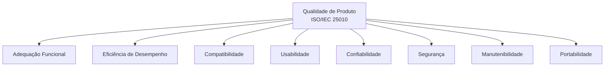

# 4. Modelo de qualidade adaptado

A ISO/IEC 25010:2011 - núcleo do *framework* SQuaRE para qualidade de produto de software -
define um modelo de **8 características** decompostas em **subcaracterísticas mensuráveis**.
Esta seção registra a **adaptação justificada** desse modelo ao contexto do AcheiUnB. A
adaptação consiste em (i) **excluir** características irrelevantes ou inviáveis para o
objeto avaliado, (ii) **manter** aquelas que serão priorizadas na avaliação e (iii) marcar
o **grau de aplicabilidade** das subcaracterísticas dentro das características mantidas,
explicitando o que será efetivamente medido nas fases seguintes.

A adaptação é guiada por **três insumos** já estabelecidos:

- O **propósito da avaliação** ([§1](01-proposito.md)), que privilegia evidências
  acionáveis sobre *componentes* do código.
- Os **stakeholders** ([§2](02-stakeholders.md)) e seus critérios de sucesso (em especial
  a equipe sucessora e a equipe AcheiUnB atual).
- As **restrições e implicações técnicas** do produto ([§3](03-software.md)) - em
  particular a ausência de produção pública e a ausência de testes de *frontend*.

## 4.1 Modelo ISO/IEC 25010 de referência

A versão de referência adotada é a **ISO/IEC 25010:2011 - Quality model for software
product**, cujas 8 características são:

*Figura 4.1: Modelo de qualidade de produto da ISO/IEC 25010 (referência).*

## 4.2 Adaptação ao AcheiUnB

A tabela abaixo resume o tratamento dado a cada uma das 8 características. As **mantidas
e priorizadas** são detalhadas em [§4.3](#43-detalhamento-das-caracteristicas-mantidas)
e suas justificativas de priorização são aprofundadas em [§5](05-caracteristicas.md).

| Característica | Decisão | Justificativa central |
|---|---|---|
| **Segurança** | Mantida e priorizada. | Há autenticação institucional federada (MSAL/Azure AD), JWT em *cookie*, e indícios preliminares de *secret* versionado no `settings.py`. Stakeholders (operador institucional hipotético, comunidade UnB como usuária) sensibilizam o critério. |
| **Manutenibilidade** | Mantida e priorizada. | O produto é **herdado entre equipes acadêmicas** - a continuidade do projeto depende diretamente desta característica. Há instrumentos preexistentes no AcheiUnB (Ruff, Black, Coverage, CodeCov) que serão usados como fonte. |
| **Confiabilidade** | Mantida e priorizada. | Existem fluxos críticos sensíveis a falhas (WebSocket no chat, fila Celery, *matching* assíncrono). A queda de Redis ou do *channel layer* afeta funcionalidades centrais. A profundidade é restrita a **medição em laboratório**, dada a ausência de produção pública. |
| **Adequação Funcional** | Excluída por **redução de escopo**. | A equipe T02 optou por concentrar a avaliação em **três** características (dentro do limite de 2 a 4 da premissa). A avaliação funcional depende de requisitos formais que o AcheiUnB não documenta de forma completa e seria rasa no *frontend* (sem testes automatizados, §3.3.3); parte da correção funcional do *backend* permanece indiretamente observável pela **Testabilidade/cobertura** em Manutenibilidade. |
| **Usabilidade** | Excluída por **premissa do projeto**. | A própria especificação da disciplina FGA315 proíbe a escolha de Usabilidade. |
| **Eficiência de Desempenho** | Excluída por **inviabilidade no escopo**. | Requer carga representativa de **produção**, que o AcheiUnB não tem. Medir em laboratório com carga sintética geraria valores **sem validade externa** para apoiar D1/D2 (ver §1.3). |
| **Compatibilidade** | Excluída por **baixa relevância no contexto**. | O sistema **não convive** com outros sistemas locais (sem requisito de coexistência). As poucas interfaces externas (MSAL e Cloudinary) já são padrões consolidados; risco residual baixo. |
| **Portabilidade** | Excluída por **mitigação prévia via contêineres**. | O AcheiUnB já é containerizado (Docker + Compose), o que mitiga grande parte do risco de portabilidade. Adaptabilidade entre ambientes não é prioridade no estágio MVP. |

!!! decision "Decisão registrada: avaliação concentrada em três características"
    A equipe avalia **Segurança**, **Manutenibilidade** e **Confiabilidade**. **Adequação
    Funcional**, **Eficiência**, **Compatibilidade** e **Portabilidade** ficam **fora do
    escopo desta avaliação** - não por serem "irrelevantes em absoluto", mas por
    proporcionalidade ao tempo e aos insumos disponíveis no estado atual do produto. A
    Fase 4 sinaliza, no relatório final, que elas deveriam ser reabertas caso o AcheiUnB
    venha a ser implantado em ambiente operacional real.

## 4.3 Detalhamento das características mantidas

Para cada característica mantida, listam-se as subcaracterísticas da ISO/IEC 25010 e seu
**grau de aplicabilidade** ao AcheiUnB no estado atual. O grau é classificado em três
níveis:

- **Aplicável (✓)**: existem artefatos suficientes para medir nas Fases 2-3.
- **Aplicável com restrições (~)**: existe insumo parcial; a medição exigirá adaptação ou
  amostragem.
- **Não aplicável (✗)**: ausência de insumo no estado atual; será reportada como achado.

### 4.3.1 Confiabilidade

| Subcaracterística | Aplicabilidade | Comentário |
|---|---|---|
| Maturidade | ✓ | Contagem e classificação de defeitos identificados em código, *issues* abertas e *test failures*. |
| Disponibilidade | ✗ | Sem ambiente de produção; será reportada como achado de escopo. |
| Tolerância a falhas | ~ | Avaliada em laboratório (ex.: comportamento sob queda de Redis ou do *channel layer*). |
| Recuperabilidade | ~ | Avaliada em laboratório (ex.: reconexão de WebSocket, *retry* de tarefas Celery). |

### 4.3.2 Segurança

| Subcaracterística | Aplicabilidade | Comentário |
|---|---|---|
| Confidencialidade | ✓ | Análise de gestão de *secrets*, *cookies* e exposição de dados sensíveis. |
| Integridade | ✓ | Validação de *inputs*, CORS, proteção contra alteração não autorizada. |
| Não repúdio | ~ | Avaliada por presença/ausência de *audit log* de ações sensíveis. |
| Autenticidade | ✓ | Avaliada via fluxo MSAL e validação de *tokens*. |
| Responsabilização | ~ | Equivalente operacional do *audit log*; depende de configuração do Django. |

### 4.3.3 Manutenibilidade

| Subcaracterística | Aplicabilidade | Comentário |
|---|---|---|
| Modularidade | ✓ | Avaliada pela separação em *apps* Django e acoplamento entre módulos. |
| Reusabilidade | ~ | Depende da existência de bibliotecas internas reaproveitáveis; análise amostral. |
| Analisabilidade | ✓ | Linters, *coverage report* e documentação técnica preexistentes. |
| Modificabilidade | ✓ | Complexidade ciclomática, tamanho de funções, dependências circulares. |
| Testabilidade | ✓ | Cobertura existente do *backend* + ausência de testes do *frontend* como achado. |

## 4.4 Modelo adaptado: representação gráfica

A figura 4.2 representa o modelo de qualidade após adaptação. Características em traço
forte são as **mantidas e priorizadas**; em traço tracejado, as **excluídas**, com a razão
da exclusão registrada na borda. Dentro de cada característica mantida, as
subcaracterísticas estão marcadas com seu grau de aplicabilidade.

```mermaid
flowchart TB
    Q[Qualidade de Produto<br/>ISO/IEC 25010 - adaptada ao AcheiUnB]

    Q --> SEG[Segurança]
    Q --> MAN[Manutenibilidade]
    Q --> CONF[Confiabilidade]

    Q -.->|premissa: excluída| USA[Usabilidade]
    Q -.->|redução de escopo| AF[Adequação Funcional]
    Q -.->|inviável sem produção| EP[Eficiência]
    Q -.->|baixa relevância| COMP[Compatibilidade]
    Q -.->|mitigada por Docker| PORT[Portabilidade]

    CONF --> C1[Maturidade ✓]
    CONF --> C2[Disponibilidade ✗]
    CONF --> C3[Tolerância a falhas ~]
    CONF --> C4[Recuperabilidade ~]

    SEG --> S1[Confidencialidade ✓]
    SEG --> S2[Integridade ✓]
    SEG --> S3[Não repúdio ~]
    SEG --> S4[Autenticidade ✓]
    SEG --> S5[Responsabilização ~]

    MAN --> M1[Modularidade ✓]
    MAN --> M2[Reusabilidade ~]
    MAN --> M3[Analisabilidade ✓]
    MAN --> M4[Modificabilidade ✓]
    MAN --> M5[Testabilidade ✓]

    classDef priorizada fill:#e8eaf6,stroke:#3949ab,stroke-width:2px;
    classDef excluida fill:#fafafa,stroke:#9e9e9e,stroke-dasharray: 4 4,color:#9e9e9e;
    class SEG,MAN,CONF priorizada
    class AF,USA,EP,COMP,PORT excluida
```

*Figura 4.2: Modelo de qualidade ISO/IEC 25010 adaptado ao AcheiUnB. Caixas sólidas =
mantidas e priorizadas; caixas tracejadas = excluídas (com razão na borda); marcadores
nas folhas = grau de aplicabilidade da subcaracterística (✓ aplicável; ~ aplicável com
restrições; ✗ não aplicável).*

## 4.5 Ligação do modelo com a avaliação

O modelo adaptado dirige as decisões das seções seguintes:

- **§5 (Seleção e priorização)** opera apenas sobre as três características em traço
  forte. A priorização entre elas usa um **método explícito** (matriz impacto×risco) e
  considera o critério de sucesso de cada *stakeholder*.
- **§6 (Escopo e profundidade)** declara, para cada subcaracterística marcada como `~` ou
  `✗`, a operação concreta na fase de medição (amostragem, adaptação de instrumento ou
  exclusão registrada).
- **Fases 2 a 4** vão derivar métricas, instrumentos e critérios de aceitação a partir
  **somente das folhas marcadas como `✓` ou `~`**, garantindo rastreabilidade entre
  modelo, métrica e resultado.

## Histórico de versão

| Versão | Data       | Descrição                | Autor(es)                              | Revisor(es)                              |
|--------|------------|--------------------------|----------------------------------------|------------------------------------------|
| 1.0    | 2026-05-13 | Versão inicial da seção. | Ana Joyce, Julia Vitória, Luis Lima    | Davi Casseb, Letícia Hladczuk, Samuel Afonso |

## Referências

1. ISO/IEC 25010:2011. *Systems and software engineering: Systems and software Quality Requirements and Evaluation (SQuaRE): System and software quality models*. International Organization for Standardization, 2011.
2. ISO/IEC 25040:2011. *Systems and software engineering: Systems and software Quality Requirements and Evaluation (SQuaRE): Evaluation process*. International Organization for Standardization, 2011.
3. ISO/IEC 25000:2014. *Systems and software engineering: Systems and software Quality Requirements and Evaluation (SQuaRE): Guide to SQuaRE*. International Organization for Standardization, 2014.
