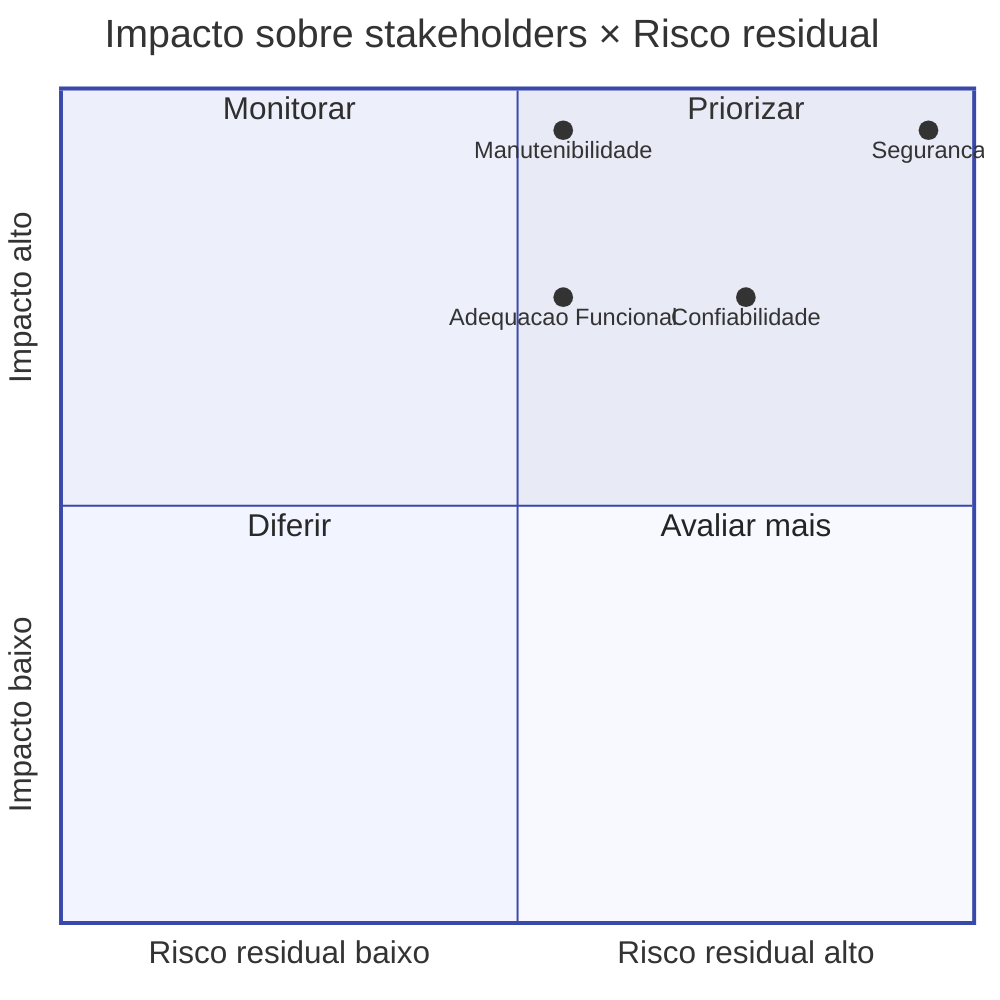

# 5. Seleção e priorização de características

Esta seção formaliza, sobre o **modelo adaptado** definido em [§4](04-modelo-qualidade.md),
a **seleção** das características de qualidade que serão efetivamente avaliadas e a
**priorização** entre elas. A seleção respeita as premissas do projeto (mínimo de 2, máximo
de 4, exclusão de Usabilidade) e parte do recorte já justificado em §4. A priorização usa
um **método explícito** (matriz impacto × risco com pesos), com **trade-offs discutidos**
ao final.

## 5.1 Características selecionadas

As quatro características mantidas no modelo adaptado são as **selecionadas para avaliação**:

1. **Segurança**
2. **Manutenibilidade**
3. **Adequação Funcional**
4. **Confiabilidade**

A justificativa de **por que essas quatro e não outras** está em [§4.2](04-modelo-qualidade.md#42-adaptacao-ao-acheiunb).
Esta seção concentra-se em **como priorizá-las entre si**, dado que a equipe T02 tem
recurso (tempo, pessoas) finito para a Fase 2.

## 5.2 Critérios de priorização

A priorização adota **quatro critérios**, ponderados, derivados das seções anteriores:

| Critério | Pergunta orientadora | Origem | Peso |
|---|---|---|---|
| **C1. Impacto sobre stakeholders** | Quanto a qualidade desta característica afeta diretamente o critério de sucesso dos stakeholders identificados? | §2 | 0,30 |
| **C2. Risco residual** | Qual o tamanho da *superfície de problemas* prováveis nesta característica no estado atual do AcheiUnB? | §3 | 0,30 |
| **C3. Viabilidade de medição** | Há instrumento, artefato preexistente ou amostra suficientes para medir nas Fases 2 e 3 dentro do prazo? | §3, §4 | 0,20 |
| **C4. Aderência ao propósito** | Em que medida medir esta característica apoia D1, D2 ou D3 (§1.3)? | §1 | 0,20 |

Os **pesos** refletem que **impacto** e **risco** são os principais condutores em uma
avaliação de **diagnóstico** (não de certificação), enquanto **viabilidade** e **aderência
ao propósito** funcionam como modificadores que evitam selecionar algo "importante na
teoria" mas "inavaliável na prática".

**Escala de pontuação:** inteira de 1 a 5, com a seguinte interpretação:

| Nota | Significado |
|---|---|
| 1 | Mínimo / insuficiente |
| 2 | Baixo |
| 3 | Médio |
| 4 | Alto |
| 5 | Crítico / abundante |

O **score final** de cada característica é a soma ponderada das notas pelos pesos.

## 5.3 Aplicação da matriz ao AcheiUnB

A tabela 5.1 registra a pontuação atribuída a cada característica em cada critério, com a
**justificativa textual** ao lado (auditável e revisável). O score é calculado pela soma
ponderada.

**Tabela 5.1: matriz Impacto × Risco × Viabilidade × Aderência.**

| Característica | C1 Impacto (0,30) | C2 Risco (0,30) | C3 Viabilidade (0,20) | C4 Aderência (0,20) | **Score** | **Posto** |
|---|:---:|:---:|:---:|:---:|:---:|:---:|
| **Segurança** | 5 | 5 | 4 | 5 | **4,80** | **P1** |
| **Manutenibilidade** | 5 | 3 | 5 | 5 | **4,40** | **P2** |
| **Adequação Funcional** | 4 | 3 | 5 | 4 | **3,90** | **P3** |
| **Confiabilidade** | 4 | 4 | 3 | 3 | **3,60** | **P4** |

### Justificativa das notas

#### Segurança - score 4,80

- **C1 Impacto = 5**: afeta a comunidade UnB (dados pessoais e de localização de objetos
  perdidos), o operador institucional hipotético (responsabilidade jurídica) e a próxima
  equipe (não pode herdar dívida grave de segurança).
- **C2 Risco = 5**: há indício preliminar de `SECRET_KEY` versionada no `settings.py`
  ([§3.6](03-software.md#36-restricoes-e-premissas-tecnicas)); JWT em *cookie* combinado
  com OAuth MSAL exige configuração correta de CORS, `SameSite` e validação de *token*;
  poucos pontos de auditoria.
- **C3 Viabilidade = 4**: Bandit e Safety já rodam no CI do AcheiUnB; revisão de
  configuração é direta; análise dinâmica de autenticação é factível em laboratório, mas
  custosa.
- **C4 Aderência = 5**: D2 cita explicitamente decisões sobre autenticação MSAL+JWT e
  *secret management*.

#### Manutenibilidade - score 4,40

- **C1 Impacto = 5**: é a *essência* da decisão D1 (priorização do *backlog* da próxima
  equipe). Sem essa característica, a continuidade do produto não é viável.
- **C2 Risco = 3**: CI do AcheiUnB já roda Black, Ruff e Coverage; risco é moderado, com
  foco em complexidade e cobertura de *frontend*.
- **C3 Viabilidade = 5**: instrumentos preexistentes e amplamente disponíveis; análise
  estática é a mais barata de todas.
- **C4 Aderência = 5**: D1 e D2 dependem de juízo sobre manutenibilidade dos componentes.

#### Adequação Funcional - score 3,90

- **C1 Impacto = 4**: stakeholders sucessores precisam saber o que funciona; usuário final
  ainda hipotético reduz a urgência.
- **C2 Risco = 3**: existe suíte de testes no *backend*; *frontend* sem testes é o
  principal vetor de risco.
- **C3 Viabilidade = 5**: *test suite* preexistente reaproveitável; cenários funcionais
  reproduzíveis via Docker.
- **C4 Aderência = 4**: a decisão D2 ("manter/refatorar/substituir") depende, em parte, de
  saber o que está funcionalmente correto.

#### Confiabilidade - score 3,60

- **C1 Impacto = 4**: o módulo de chat em tempo real e o *matching* assíncrono são
  funcionalidades centrais; falhas afetariam usuários reais (quando houver).
- **C2 Risco = 4**: WebSocket + Redis + Celery formam uma superfície de falha relevante.
- **C3 Viabilidade = 3**: medição em laboratório é factível, mas com perda de validade
  externa (sem produção pública).
- **C4 Aderência = 3**: D2 menciona o chat, mas não como componente prioritário.

## 5.4 Diagrama da priorização

*Figura 5.1: quadrante de impacto × risco para as quatro características selecionadas. O
quadrante superior-direito ("Priorizar") concentra Segurança; Manutenibilidade e
Adequação Funcional aparecem no quadrante superior-esquerdo, com alto impacto e risco
moderado; Confiabilidade aparece à direita, com risco moderado-alto, mas impacto menor
no estado atual (sem produção).*

## 5.5 Resultado da priorização

| Posto | Característica | Score | Implicação para a Fase 2 |
|---|---|---|---|
| **P1** | Segurança | 4,80 | Maior alocação de esforço de medição. Análise estática + dinâmica de autenticação e *secrets*. |
| **P2** | Manutenibilidade | 4,40 | Análise estática consolidada (Ruff, Black, Coverage, complexidade), inspeção arquitetural amostral. |
| **P3** | Adequação Funcional | 3,90 | Reaproveitamento da *test suite* existente do *backend* + amostragem manual no *frontend*. |
| **P4** | Confiabilidade | 3,60 | Cenários de laboratório (queda de Redis, reconexão WS, *retry* Celery); cobertura mais estreita. |

A priorização **não exclui** nenhuma das quatro: todas serão avaliadas. O que muda é a
**profundidade** e o **esforço alocado** (formalizado em [§6](06-escopo.md)).

## 5.6 Trade-offs discutidos

A escolha do método e dos pesos tem implicações que merecem registro explícito.

### Trade-offs do método

| Aspecto | Decisão tomada | Alternativa considerada | Por que a decisão atual |
|---|---|---|---|
| Método | Matriz ponderada (impacto×risco + dois modificadores) | MoSCoW com pesos; AHP (*Analytic Hierarchy Process*) | MoSCoW é binário demais (Must/Should/Could/Won't) e perde gradação. AHP exige comparações par a par calibradas, custo desproporcional para 4 itens. A matriz ponderada é a menor estrutura suficiente para produzir um ranking auditável. |
| Pesos (0,30/0,30/0,20/0,20) | Impacto e Risco com peso igual; modificadores com peso menor | Pesos iguais (0,25 cada); pesos com Risco dominante | Pesos iguais subestimam o impacto sobre stakeholders, que é o objetivo de uma avaliação acadêmica voltada a sucessores. Risco dominante distorceria em direção a "consertar bug" em vez de "diagnosticar produto". |
| Escala 1-5 | Inteira de 1 a 5 | Escala 0-10; escala qualitativa | 1-5 é granular o suficiente para discriminar 4 itens, sem dar falsa precisão. |

### Trade-offs do resultado

| Trade-off | Consequência | Mitigação |
|---|---|---|
| Confiabilidade ficou em P4. | Cenários de falha do chat e da fila assíncrona terão menos profundidade. | A Fase 4 registrará explicitamente, no relatório final, que **Confiabilidade em ambiente operacional** fica como recomendação de reavaliação caso o AcheiUnB seja implantado. |
| Adequação Funcional reaproveita testes do *backend* e amostra o *frontend*. | Risco de subestimar defeitos do *frontend*. | A ausência de testes no *frontend* será reportada como achado da Fase 4 (independentemente do score). |
| Segurança tem alta exigência de instrumentação na Fase 2. | Risco de extrapolar o prazo. | A Fase 2 vai definir um conjunto **mínimo viável** de métricas em segurança antes de expandir. |
| Manutenibilidade pesa muito em D1, mas as medidas tradicionais (Ruff, complexidade) podem refletir mais o estilo do que o problema. | Risco de relatório "raso" em manutenibilidade. | Combinar análise estática automática com **inspeção arquitetural amostral** (acoplamento entre *apps*, dependências circulares). |

## 5.7 Relação com stakeholders

Esta priorização opera como uma **expressão concreta dos critérios de sucesso** dos
stakeholders mapeados em [§2](02-stakeholders.md):

- **Próximas equipes MDS (sucessoras)** → favorecidas por P1 e P2 (recebem o produto sem
  passivos de segurança e com indicadores claros de manutenibilidade).
- **Equipe AcheiUnB 2024-2** → favorecida por P2 e P3 (o diagnóstico é sobre
  *seu* código, com ferramentas que ela mesma já adotou no CI).
- **Operador institucional hipotético** → favorecido por P1 e P4 (segurança e
  confiabilidade são pré-requisitos operacionais).
- **Comunidade UnB** → favorecida por P1 (dados pessoais) e P3 (funcionalidade efetiva).
- **Profa. Cristiane Ramos (requisitante)** → favorecida pela rastreabilidade do método e
  pelos *trade-offs* explícitos, que permitem auditoria objetiva da rubrica.

A próxima seção ([§6](06-escopo.md)) traduz essa priorização em **escopo, profundidade e
objetos de avaliação**.
