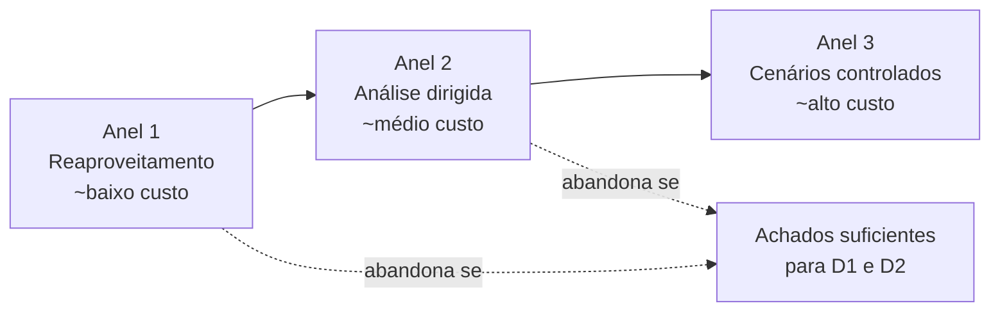

# 6. Escopo, profundidade e objetos de avaliação

Esta seção traduz as decisões anteriores (propósito em [§1](01-proposito.md), stakeholders
em [§2](02-stakeholders.md), descrição do produto em [§3](03-software.md), modelo adaptado
em [§4](04-modelo-qualidade.md) e priorização em [§5](05-caracteristicas.md)) em **limites
operacionais** da avaliação: o que **entra** no escopo agora, em **que profundidade**, o
que fica **fora** (e por quê) e quais **objetos de avaliação** serão efetivamente
manipulados. O capítulo encerra com o **plano de cobertura progressiva** e a declaração de
**limites de validade** dos resultados.

## 6.1 Princípios de delimitação

Quatro princípios orientam o recorte do escopo:

1. **Coerência com o propósito.** Só entra no escopo o que apoia D1, D2 ou D3 ([§1.3](01-proposito.md#13-uso-pretendido-dos-resultados)).
2. **Reaproveitamento antes de produção.** Antes de produzir novo dado, reaproveitar
   instrumentos já existentes no AcheiUnB (Bandit, Safety, Ruff, Black, Coverage, CodeCov,
   *test suite*).
3. **Profundidade proporcional à prioridade.** A profundidade é alocada na ordem do ranking
   da §5 (P1 > P2 > P3 > P4).
4. **Cortes explícitos.** Todo elemento excluído é registrado com **racional** e com
   **condição de reabertura** em avaliações futuras.

## 6.2 Dentro do escopo

### 6.2.1 Características avaliadas

As **quatro características priorizadas em §5**, com a profundidade indicada na tabela 6.1.

**Tabela 6.1: profundidade planejada por característica.**

| Posto | Característica | Profundidade | Operações concretas previstas |
|---|---|---|---|
| **P1** | Segurança | **Alta** | Inspeção da configuração Django (`settings.py`, *middlewares*, backends de auth); análise de gestão de *secrets*; reexecução e análise dos relatórios Bandit/Safety; revisão do fluxo MSAL/JWT; checagem de exposição de *cookies* e CORS; revisão amostral de *endpoints* sensíveis. |
| **P2** | Manutenibilidade | **Alta** | Reexecução de Ruff, Black, Coverage; cálculo de complexidade ciclomática e tamanho de funções; mapa de dependências entre *apps*; análise da estrutura de testes; verificação de documentação técnica do código. |
| **P3** | Adequação Funcional | **Média** | Reaproveitamento da *test suite* do *backend*; mapeamento requisito↔teste para um conjunto amostral de funcionalidades; execução manual de cenários no *frontend* (sem suíte automática). |
| **P4** | Confiabilidade | **Baixa-Média (laboratório)** | Cenários controlados em Docker: queda de Redis, desconexão de WebSocket, *retry* de tarefas Celery; análise de tratamento de exceções no código. |

### 6.2.2 Objetos de avaliação

Os **objetos** sobre os quais incidirá a medição na Fase 2 são:

| Categoria | Objeto | Onde mora | Profundidade |
|---|---|---|---|
| Código | `API/` (Django + DRF + Channels) | Repositório AcheiUnB | Alta |
| Configuração | `API/AcheiUnB/settings.py`, `docker-compose.yml`, `.env*` | Repositório AcheiUnB | Alta |
| Pipelines | `.github/workflows/*` (CI/CD) | Repositório AcheiUnB | Média |
| Documentação | `docs/`, `README.md`, `CONTRIBUTING.md` | Repositório AcheiUnB | Média |
| Testes | `API/**/test_*.py`, `pytest.ini`, `pyproject.toml` | Repositório AcheiUnB | Média |
| *Frontend* | `web/src/**` | Repositório AcheiUnB | Baixa (amostral) |
| Histórico | `git log`, *issues*, *pull requests* | GitHub | Baixa |

### 6.2.3 Ambiente de execução

| Item | Decisão |
|---|---|
| Plataforma | Local containerizado (Docker + docker-compose), conforme o `docker-compose.yml` do AcheiUnB. |
| Sistema operacional | Linux. |
| Versões | A *tag* / *commit* do `unb-mds/2024-2-AcheiUnB` será fixada no início da Fase 2. |
| Dados | Ambiente sintético (sem dados reais). |
| Provedores externos | MSAL/Azure AD — uso somente em modo desenvolvimento, com aplicação de teste; Cloudinary — uso com conta sintética. |

## 6.3 Fora do escopo

A tabela 6.2 lista os elementos **explicitamente excluídos**, com racional e condição de
reabertura. A norma SQuaRE exige que cortes sejam registrados; este registro também serve
de **insumo para futuras avaliações**.

**Tabela 6.2: cortes de escopo.**

| Excluído | Racional | Condição de reabertura |
|---|---|---|
| **Usabilidade** | Premissa da disciplina (§1). | Não aplicável. |
| **Eficiência de desempenho** | Sem produção pública; carga sintética sem validade externa (§4). | Implantação operacional do AcheiUnB. |
| **Compatibilidade** | Baixo requisito de coexistência; integrações externas (MSAL, Cloudinary) são padrões consolidados (§4). | Caso o AcheiUnB venha a coexistir com outros sistemas institucionais da UnB. |
| **Portabilidade** | Mitigada por Docker; baixa prioridade no MVP (§4). | Adoção em ambientes não-containerizados. |
| **Disponibilidade real (subcaracterística de Confiabilidade)** | Sem ambiente operacional (§4.3.2). | Implantação operacional. |
| **Satisfação de usuários reais** | Sem operação pública; entrevistas com usuários finais fora do método (§2.4). | Operação aberta à comunidade UnB com instrumento de coleta de satisfação. |
| **Auditoria de licenciamento jurídico** | Fora do escopo técnico; será reportado como achado caso a licença permaneça ausente. | Necessidade de adoção institucional. |
| **Teste de carga (*load testing*)** | Sem dados representativos; resultados não-acionáveis. | Implantação operacional + base de uso real. |
| **Avaliação do código *frontend* em profundidade alta** | Ausência de testes automatizados (§3.3.3) reduz custo-benefício; será coberto por amostragem. | Existência de suíte de testes para o *frontend*. |

!!! info "Como ler 'fora do escopo'"
    Estar fora do escopo **não significa "irrelevante"**. Significa que, na **janela e
    com os recursos** desta avaliação, não é factível produzir resultado válido. A Fase
    4 registrará esses pontos como **recomendações de continuidade**.

## 6.4 Plano de cobertura progressiva

A avaliação é dividida em **três anéis** de cobertura, do mais barato para o mais caro.
Cada anel é avaliado quanto a custo, tempo e benefício antes de avançar.

*Figura 6.1: cobertura progressiva. Cada anel só é executado se o anterior **não bastou**
para apoiar as decisões D1 e D2 (§1.3).*

### Anel 1 — Reaproveitamento

- Reexecução dos *workflows* de CI do AcheiUnB (Ruff, Black, Bandit, Safety, Coverage).
- Mapeamento dos relatórios de CodeCov existentes.
- Leitura sistemática da documentação técnica (`docs/`).

### Anel 2 — Análise dirigida

- Análise estática direcionada: complexidade ciclomática, acoplamento entre *apps*,
  dependências circulares, anti-padrões em *settings*.
- Inspeção arquitetural amostral.
- Mapeamento requisito↔teste para conjunto amostral de funcionalidades.
- Revisão manual do *frontend* em pontos críticos (autenticação, *upload*, chat).

### Anel 3 — Cenários controlados

- Execução em Docker com queda intencional de serviços (Redis, *channel layer*).
- Reconexão de WebSocket; *retry* de tarefas Celery.
- Tentativas de uso indevido de *cookies* JWT; CORS e *SameSite*.

## 6.5 Limites de validade dos resultados

A leitura de qualquer resultado desta avaliação deve respeitar os limites a seguir.

| Limite | Implicação prática |
|---|---|
| **Instantâneo único.** Toda métrica refere-se à *tag*/*commit* fixado no início da Fase 2. | Resultados envelhecem com o repositório; revisões posteriores demandam nova execução. |
| **Análise majoritariamente estática.** A medição dinâmica fica restrita à Confiabilidade (laboratório) e à Adequação Funcional (suíte existente). | Defeitos *only-runtime* podem passar despercebidos. |
| **Ambiente local.** Não há produção comparável. | Métricas operacionais (disponibilidade real, latência sob carga) **não** estão no escopo. |
| **Sem entrevistas.** Stakeholders externos foram considerados em §2 sem coleta direta. | Critérios de sucesso de usuário/operador foram **inferidos** a partir do produto e da documentação, não confirmados. |
| **Avaliadores não-desenvolvedores do AcheiUnB.** A equipe T02 não participou da construção do produto. | Vantagem: independência. Desvantagem: conhecimento tácito menor; mitigado por leitura sistemática da documentação. |
| **Janela de tempo curta (um semestre).** | A profundidade dos anéis 2 e 3 é proporcional ao tempo disponível. Achados podem ser parciais. |

## 6.6 Relação com avaliações anteriores e futuras

Não há, até onde a equipe T02 identificou, **avaliação SQuaRE anterior do AcheiUnB**.
Existem, no entanto, **artefatos de qualidade preexistentes** que são tratados como
*evidência*, não como avaliação:

- Relatórios de cobertura no CodeCov.
- Histórico de execução do *pipeline* (Bandit, Safety).
- Documentos internos do AcheiUnB (`CONTRIBUTING.md`, padrões de *commits* e *branches*).

A **continuidade futura** prevista é:

- **Reabertura** de Eficiência, Compatibilidade, Portabilidade e Disponibilidade em caso
  de implantação operacional do AcheiUnB.
- **Comparação longitudinal** com versões posteriores do mesmo produto, usando os
  artefatos desta avaliação como **baseline**.
- **Replicação do método** sobre outros projetos da disciplina MDS, com matriz de
  priorização da §5 como ponto de partida.
