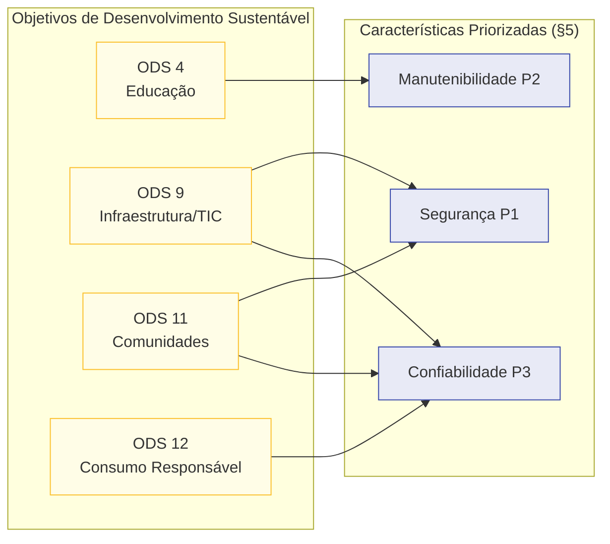

# 7. ODS, metas e indicadores relacionados

Esta seção articula o **vínculo do AcheiUnB e desta avaliação** com os **Objetivos de
Desenvolvimento Sustentável (ODS)** da Agenda 2030 das Nações Unidas. A premissa do
projeto exige que os ODS sejam relacionados **no nível de metas e indicadores
relevantes** - não basta citar o objetivo. Para cada ODS, registra-se: a meta vinculada,
o indicador da meta (na nomenclatura oficial), o vínculo com o AcheiUnB e a
**pertinência específica à avaliação de qualidade**.

## 7.1 ODS selecionados

Quatro ODS foram selecionados como **diretamente relacionados** ao AcheiUnB:

| ODS | Título | Meta principal | Indicador da meta |
|---|---|---|---|
| **ODS 4** | Educação de Qualidade | 4.3 | 4.3.1 |
| **ODS 9** | Indústria, Inovação e Infraestrutura | 9.c | 9.c.1 |
| **ODS 11** | Cidades e Comunidades Sustentáveis | 11.7 | 11.7.1 |
| **ODS 12** | Consumo e Produção Responsáveis | 12.5 | 12.5.1 |

A inclusão de cada ODS é justificada na seção seguinte. ODS sem ligação direta
(ex.: ODS 1 Erradicação da Pobreza, ODS 13 Ação contra a Mudança Global do Clima) **não
foram selecionados** por ausência de vínculo concreto entre o software avaliado e os
indicadores oficiais.

## 7.2 Justificativa por ODS

### 7.2.1 ODS 4 - Educação de Qualidade

| Item | Conteúdo |
|---|---|
| **Meta 4.3** | "Até 2030, assegurar a igualdade de acesso para todas as mulheres e homens à educação técnica, profissional e superior de qualidade, a preços acessíveis, incluindo universidade." |
| **Indicador 4.3.1** | Taxa de participação de jovens e adultos em educação e treinamento formal e não formal nos últimos 12 meses, por sexo. |
| **Vínculo com o AcheiUnB** | O AcheiUnB é mantido como **projeto educacional** pela disciplina MDS/UnB: por um lado, é um exercício didático no qual estudantes aprendem engenharia de software aplicada; por outro, serve a comunidade da própria universidade. A avaliação de qualidade do produto **realimenta o processo de ensino** ao caracterizar gaps técnicos e fornecer um *backlog* objetivo para as próximas equipes da disciplina. |
| **Pertinência à avaliação** | A **Manutenibilidade** (P2 em §5) é a característica de qualidade diretamente conectada a esse ODS: um produto manutenível **viabiliza** a sucessão pedagógica entre semestres, sustentando o aprendizado. |

### 7.2.2 ODS 9 - Indústria, Inovação e Infraestrutura

| Item | Conteúdo |
|---|---|
| **Meta 9.c** | "Aumentar significativamente o acesso às tecnologias de informação e comunicação e se empenhar para oferecer acesso universal e a preços acessíveis à internet nos países menos desenvolvidos, até 2020." |
| **Indicador 9.c.1** | Proporção da população coberta por uma rede móvel, por tecnologia. |
| **Vínculo com o AcheiUnB** | O AcheiUnB é **infraestrutura digital institucional** de pequena escala. Mesmo limitado ao contexto UnB, exemplifica como tecnologia da informação produzida na universidade pode prover serviços públicos a uma comunidade. A continuidade técnica do produto depende de qualidade adequada de sua infraestrutura de software. |
| **Pertinência à avaliação** | A **Confiabilidade** (P3 em §5) e a **Segurança** (P1) são as características diretamente conectadas: infraestrutura de TIC só atinge o objetivo do ODS 9 se for **confiável** e **segura**. A avaliação produz evidência sobre ambos. |

### 7.2.3 ODS 11 - Cidades e Comunidades Sustentáveis

| Item | Conteúdo |
|---|---|
| **Meta 11.7** | "Até 2030, proporcionar o acesso universal a espaços públicos seguros, inclusivos, acessíveis e verdes, particularmente para mulheres e crianças, pessoas idosas e pessoas com deficiência." |
| **Indicador 11.7.1** | Proporção média da área construída das cidades que é espaço público aberto para uso de todos, por sexo, idade e pessoas com deficiência. |
| **Vínculo com o AcheiUnB** | Os *campi* da UnB são **espaços públicos** de circulação intensiva. Um sistema de achados e perdidos eficiente reduz fricções cotidianas para a comunidade universitária, contribui para a sensação de **segurança e cuidado coletivo** com objetos pessoais e amplia o **uso confortável** desses espaços por todos os perfis de frequentadores. |
| **Pertinência à avaliação** | A **Segurança** (P1) e a **Confiabilidade** (P3) são as características diretamente conectadas: os dados de localização precisam ser tratados com confidencialidade (Segurança) e o mecanismo que devolve o objeto ao dono precisa operar de forma confiável (Confiabilidade). |

### 7.2.4 ODS 12 - Consumo e Produção Responsáveis

| Item | Conteúdo |
|---|---|
| **Meta 12.5** | "Até 2030, reduzir substancialmente a geração de resíduos por meio da prevenção, redução, reciclagem e reuso." |
| **Indicador 12.5.1** | Taxa nacional de reciclagem, em toneladas de material reciclado. |
| **Vínculo com o AcheiUnB** | Um sistema funcional de achados e perdidos **prolonga o ciclo de vida** de objetos pessoais (eletrônicos, livros, vestuário) ao devolvê-los ao dono em vez de descartá-los ou substituí-los. Mesmo em escala universitária, a iniciativa é alinhada à lógica de **reúso** central à meta 12.5. |
| **Pertinência à avaliação** | A **Confiabilidade** (P3) é a característica diretamente conectada: se os mecanismos que devolvem os itens falham (*matching* assíncrono interrompido por queda da fila Celery/Redis, chat em tempo real caindo sem reconexão), o sistema **não recupera efetivamente** os itens e o impacto declarado neste ODS evapora. A avaliação verifica a integridade do principal mecanismo (módulo de *matching* em `API/users/`, executado de forma assíncrona). |

## 7.3 Síntese: ODS × características priorizadas

A figura 7.1 conecta os quatro ODS às três características priorizadas em §5, deixando
explícita a **mediação** que a qualidade de produto exerce sobre o impacto social
declarado pelo AcheiUnB.

*Figura 7.1: mediação da qualidade de produto sobre o impacto declarado nos ODS. As setas
indicam por qual característica o impacto social passa para ser efetivamente entregue
pelo software.*

## 7.4 Implicação para a Fase 4 (relato)

O vínculo registrado nesta seção tem **duas consequências práticas** para o relatório
final:

1. **Cada achado da Fase 3** será associado, quando aplicável, ao **ODS, meta e
   característica** correspondente - fechando a cadeia "evidência técnica → característica
   de qualidade → impacto social".
2. A **Fase 4** discutirá explicitamente, no relatório final, o **gap entre o impacto
   declarado e o impacto efetivamente entregável** dado o estado atual do AcheiUnB. Isso
   evita o vício comum de relatórios institucionais que citam ODS de forma decorativa,
   sem mostrar a mediação técnica.

## Histórico de versão

| Versão | Data       | Descrição                | Autor(es)                           | Revisor(es)                              |
|--------|------------|--------------------------|-------------------------------------|------------------------------------------|
| 1.0    | 2026-05-13 | Versão inicial da seção. | Davi Casseb, Ana Joyce, Luis Lima   | Letícia Hladczuk, Julia Vitória, Samuel Afonso |

## Referências

1. ORGANIZAÇÃO DAS NAÇÕES UNIDAS. *Transformando Nosso Mundo: A Agenda 2030 para o Desenvolvimento Sustentável*. Resolução A/RES/70/1, 25 set. 2015.
2. ORGANIZAÇÃO DAS NAÇÕES UNIDAS. *Objetivo 4: Educação de Qualidade*. Disponível em: <https://brasil.un.org/pt-br/sdgs/4>. Acesso em: 13 maio 2026.
3. ORGANIZAÇÃO DAS NAÇÕES UNIDAS. *Objetivo 9: Indústria, Inovação e Infraestrutura*. Disponível em: <https://brasil.un.org/pt-br/sdgs/9>. Acesso em: 13 maio 2026.
4. ORGANIZAÇÃO DAS NAÇÕES UNIDAS. *Objetivo 11: Cidades e Comunidades Sustentáveis*. Disponível em: <https://brasil.un.org/pt-br/sdgs/11>. Acesso em: 13 maio 2026.
5. ORGANIZAÇÃO DAS NAÇÕES UNIDAS. *Objetivo 12: Consumo e Produção Responsáveis*. Disponível em: <https://brasil.un.org/pt-br/sdgs/12>. Acesso em: 13 maio 2026.
6. INSTITUTO DE PESQUISA ECONÔMICA APLICADA (IPEA). *Metas Nacionais dos Objetivos de Desenvolvimento Sustentável*. Brasília: Ipea, 2018.
