# 6. Representação da Hierarquia GQM (Gráfico GQM)

Esta seção apresenta o **diagrama da hierarquia GQM**, que consolida visualmente todo o plano de medição desenvolvido nesta fase. O gráfico ilustra a rastreabilidade desde os **Objetivos (G)** de alto nível, passando pelas **Questões (Q)** que os detalham, até as **Métricas (M)** que fornecerão os dados para respondê-las.

Esta representação gráfica serve como um mapa de referência rápido para todo o processo de avaliação, garantindo que cada atividade de medição na Fase 3 esteja diretamente conectada a um objetivo de negócio ou de qualidade definido na Fase 1.

## Diagrama GQM Completo

O diagrama a seguir abrange os três objetivos priorizados: Segurança (G1), Manutenibilidade (G2) e Confiabilidade (G3).

```mermaid
graph LR
    subgraph GQM Hierarchy - AcheiUnB Quality Evaluation

        %% Goals
        G1["<b>G1: Analisar Segurança</b>"];
        G2["<b>G2: Analisar Manutenibilidade</b>"];
        G3["<b>G3: Analisar Confiabilidade</b>"];

        %% Styling
        classDef goal fill:#e8eaf6,stroke:#3949ab,stroke-width:2px;
        classDef question fill:#e3f2fd,stroke:#1565c0;
        classDef metric fill:#e0f2f1,stroke:#00695c;
        class G1,G2,G3 goal;

        %% G1 -> Questions
        G1 --> Q1_1["Q1.1: Gestão de segredos<br/>protegida?"];
        G1 --> Q1_2["Q1.2: Configs. de segurança<br/>alinhadas?"];
        G1 --> Q1_3["Q1.3: Fluxo de autenticação<br/>seguro?"];
        class Q1_1,Q1_2,Q1_3 question;

        %% Q1.1 -> Metrics
        Q1_1 --> M1_1_1["M1.1.1: Nº de segredos no código"];
        Q1_1 --> M1_1_2["M1.1.2: .env no .gitignore"];
        class M1_1_1,M1_1_2 metric;

        %% Q1.2 -> Metrics
        Q1_2 --> M1_2_1["M1.2.1: Contagem de M/H (Bandit)"];
        Q1_2 --> M1_2_2["M1.2.2: Checklist de config. Django"];
        class M1_2_1,M1_2_2 metric;

        %% Q1.3 -> Metrics
        Q1_3 --> M1_3_1["M1.3.1: Checklist de atributos do cookie"];
        Q1_3 --> M1_3_2["M1.3.2: Validade da assinatura JWT"];
        class M1_3_1,M1_3_2 metric;


        %% G2 -> Questions
        G2 --> Q2_1["Q2.1: Código segue padrões<br/>e é modular?"];
        G2 --> Q2_2["Q2.2: Nível de complexidade<br/>do código?"];
        G2 --> Q2_3["Q2.3: Cobertura de testes<br/>suficiente?"];
        class Q2_1,Q2_2,Q2_3 question;

        %% Q2.1 -> Metrics
        Q2_1 --> M2_1_1["M2.1.1: Violações (Ruff)"];
        Q2_1 --> M2_1_2["M2.1.2: Dependências circulares"];
        class M2_1_1,M2_1_2 metric;

        %% Q2.2 -> Metrics
        Q2_2 --> M2_2_1["M2.2.1: Complexidade ciclomática média"];
        Q2_2 --> M2_2_2["M2.2.2: Contagem de funções complexas"];
        class M2_2_1,M2_2_2 metric;

        %% Q2.3 -> Metrics
        Q2_3 --> M2_3_1["M2.3.1: Cobertura de testes (backend)"];
        Q2_3 --> M2_3_2["M2.3.2: Nº de testes (frontend)"];
        class M2_3_1,M2_3_2 metric;

        %% G3 -> Questions
        G3 --> Q3_1["Q3.1: Tolerante a falhas<br/>em serviços?"];
        G3 --> Q3_2["Q3.2: Capaz de se recuperar<br/>de falhas?"];
        class Q3_1,Q3_2 question;

        %% Q3.1 -> Metrics
        Q3_1 --> M3_1_1["M3.1.1: Comportamento sob<br/>queda do Redis"];
        class M3_1_1 metric;

        %% Q3.2 -> Metrics
        Q3_2 --> M3_2_1["M3.2.1: Reconexão do WebSocket"];
        Q3_2 --> M3_2_2["M3.2.2: Política de retry (Celery)"];
        class M3_2_1,M3_2_2 metric;

    end
```

*Figura 6.1: Diagrama da hierarquia GQM, mostrando a decomposição dos três objetivos de medição em questões e, subsequentemente, em métricas coletáveis.*

## Histórico de versão

| Versão | Data       | Descrição | Autor(es) | Revisor(es) |
| :-- | :-- | :-- | :-- | :-- |
| 1.0 | 2026-06-12 | Criação do diagrama da hierarquia GQM. | Luis | Julia, Letícia |
