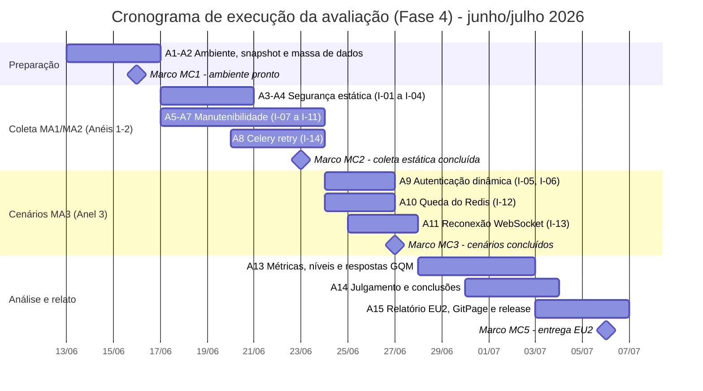

# 3. Cronograma da Avaliação

Esta seção distribui no tempo, e entre os membros da equipe, as **atividades de execução
da avaliação** ([Fase 4](../fase4/index.md)), conforme as instruções da
[seção 1](01-metodo-instrucoes.md) e os recursos da [seção 2](02-recursos-ambiente.md).
O cronograma é dimensionado para a janela entre a consolidação deste plano e a entrega
EU2, e segue dois princípios herdados da Fase 1:

1. **Prioridade P1 > P2 > P3** ([Fase 1, §5.5](../fase1/05-caracteristicas.md#55-resultado-da-priorizacao)):
   Segurança e Manutenibilidade entram primeiro e recebem mais esforço; Confiabilidade
   ocupa a janela final, com cenários mais curtos.
2. **Cobertura progressiva em anéis** ([Fase 1, §6.4](../fase1/06-escopo.md#64-plano-de-cobertura-progressiva)):
   o reaproveitamento e a análise estática (Anel 1/2, métodos MA1/MA2) antecedem os
   cenários controlados (Anel 3, método MA3), que são os mais caros.

## 3.1 Marcos

**Tabela 3.1: marcos do cronograma.**

| Marco | Data | Critério de conclusão |
|---|---|---|
| **MC0** - Plano de Avaliação aprovado (esta Fase 3) | 12/06/2026 | Seções 1, 2 e 3 revisadas e publicadas na GitPage. |
| **MC1** - Ambiente pronto e *snapshot* fixado | 16/06/2026 | Procedimento da [seção 2.5](02-recursos-ambiente.md#25-procedimento-de-preparacao-do-ambiente) concluído em 2 estações; hash registrado em `dados/00-snapshot.md`. |
| **MC2** - Coleta estática e documental concluída (MA1 + MA2) | 23/06/2026 | I-01 a I-04, I-07 a I-11 e I-14 com dados brutos validados pelo curador. |
| **MC3** - Cenários de laboratório concluídos (MA3) | 27/06/2026 | I-05, I-06, I-12 e I-13 executados, gravados e validados. |
| **MC4** - Análise GQM e julgamento concluídos | 02/07/2026 | Métricas comparadas aos níveis da [Fase 2, §5](../fase2/05-niveis-pontuacao.md); questões e hipóteses respondidas. |
| **MC5** - Relatório EU2, GitPage e *release* | 06/07/2026 | Relatório PDF submetido no Moodle; GitPage atualizada; *release* EU2 publicada. |

## 3.2 Distribuição das atividades

**Tabela 3.2: atividades, instruções, responsáveis e janelas de execução.**

| # | Atividade | Instruções | Método | Responsáveis (titular / apoio ou observador) | Janela |
|---|---|---|---|---|---|
| A1 | Fixação do *snapshot* e preparação do ambiente nas estações | [§2.5](02-recursos-ambiente.md#25-procedimento-de-preparacao-do-ambiente) | - | Luis Lima / Samuel Afonso | 13-16/06 |
| A2 | Criação da massa de dados sintética (`seed_avaliacao.py`, contas e mídia de teste) | [§2.4](02-recursos-ambiente.md#24-massa-de-dados) | - | Samuel Afonso / Luis Lima | 13-16/06 |
| A3 | Varredura de segredos e inspeção do `.gitignore` | I-01, I-02 | MA1, MA2 | Davi Casseb / Letícia Hladczuk | 17-19/06 |
| A4 | Bandit e checklist de configuração Django | I-03, I-04 | MA1, MA2 | Letícia Hladczuk / Davi Casseb | 17-20/06 |
| A5 | Ruff e mapa de dependências entre *apps* | I-07, I-08 | MA1 | Ana Joyce / Julia Vitória | 17-20/06 |
| A6 | Complexidade ciclomática (Radon) e consolidação por módulo | I-09 | MA1 | Julia Vitória / Ana Joyce | 19-22/06 |
| A7 | Cobertura de testes do *backend* e contagem no *frontend* | I-10, I-11 | MA1, MA2 | Ana Joyce / Julia Vitória | 20-23/06 |
| A8 | Inspeção de `retry` nas tarefas Celery | I-14 | MA2 | Luis Lima / Samuel Afonso | 20-23/06 |
| A9 | Ensaios dinâmicos de autenticação (cookie e JWT manipulado) | I-05, I-06 | MA3 | Davi Casseb / Letícia Hladczuk (observadora) | 24-26/06 |
| A10 | Cenário de queda do Redis | I-12 | MA3 | Luis Lima / Samuel Afonso (observador) | 24-26/06 |
| A11 | Cenário de reconexão do WebSocket (duas variantes) | I-13 | MA3 | Samuel Afonso / Luis Lima (observador) | 25-27/06 |
| A12 | Curadoria final dos dados brutos (nomenclatura, `*.meta.md`, integridade) | [§1.2](01-metodo-instrucoes.md#12-regras-gerais-de-execucao-validas-para-todas-as-instrucoes) | - | Letícia Hladczuk | contínua até 27/06 |
| A13 | Cálculo das métricas, comparação com níveis de pontuação e resposta às questões/hipóteses GQM | Fase 4, §3 | - | Julia Vitória, Ana Joyce / todos | 28/06-02/07 |
| A14 | Julgamento, conclusões e sugestões de melhoria (coerência com o propósito da Fase 1) | Fase 4, §4-§5 | - | Davi Casseb, Luis Lima / todos | 30/06-03/07 |
| A15 | Redação final do relatório EU2, atualização da GitPage e *release* | - | - | Todos (revisão cruzada em duplas) | 03-06/07 |

A alocação preserva as **duplas por característica** definidas na
[Tabela 2.1](02-recursos-ambiente.md#21-recursos-humanos-e-conhecimento-exigido)
(Segurança: Davi e Letícia; Manutenibilidade: Ana Joyce e Julia; Confiabilidade: Luis e
Samuel), de modo que o conhecimento exigido por instrução coincide com o perfil do
responsável.

## 3.3 Linha do tempo

*Figura 3.1: gráfico de Gantt da execução. As coletas estáticas das três
características correm em paralelo por duplas; os cenários de laboratório (Anel 3) só
iniciam após o marco MC2, conforme a estratégia de cobertura progressiva.*

## 3.4 Folgas e plano de contingência

O cronograma reserva folgas explícitas e regras de corte para manter o realismo:

| Risco | Sinal | Contingência |
|---|---|---|
| Ambiente não sobe até MC1 (dependências quebradas, credenciais de teste). | Marco MC1 não atingido em 16/06. | Folga embutida de 2 dias úteis (17-18/06) usando apenas instruções MA1/MA2 que não exigem o sistema no ar (I-01 a I-04, I-07 a I-11, I-14). |
| Cenários MA3 excedem o previsto (regravações, resets de ambiente). | Mais de 2 ensaios inválidos na mesma instrução. | Reduzir I-13 a uma única variante (modo *offline* do cliente), registrando o corte e seu racional no relatório, sem afetar M3.2.1. |
| Divergência entre execuções duplas (MA1). | Valores diferentes na 1ª e 2ª execução. | Janela de investigação de 1 dia por métrica (verificar versão da ferramenta e *snapshot*) antes de MC2; persiste a divergência, a coleta é refeita em segunda estação. |
| Indisponibilidade de provedor externo (Azure AD, Cloudinary). | Falha de login/upload não atribuível ao AcheiUnB. | Suspensão e reagendamento da coleta dentro da janela MA3 ([§2.6](02-recursos-ambiente.md#26-restricoes-e-salvaguardas-do-ambiente)); folga de 27/06 destinada a reexecuções. |
| Atraso geral acumulado. | MC3 não atingido em 27/06. | A análise (A13) inicia com os dados já validados, em paralelo às reexecuções pendentes; o relatório registra explicitamente qualquer métrica coletada fora da janela planejada. |

## 3.5 Alinhamento com a Fase 4

Cada atividade do cronograma corresponde diretamente a um resultado esperado da Fase 4:
A3-A11 produzem a **obtenção das medidas** e os **dados brutos** (Fase 4, §1-§2,
critérios F4-C1 e F4-C2); A13 produz a **análise e respostas GQM** (Fase 4, §3,
critério F4-C3); A14 produz a **coerência com o propósito** e o **julgamento com
sugestões de melhoria** (Fase 4, §4-§5, critérios F4-C4 e F4-C5), apoiando as decisões
D1 e D2 declaradas na [Fase 1, §1.3](../fase1/01-proposito.md#13-uso-pretendido-dos-resultados).

## Histórico de versão

| Versão | Data       | Descrição | Autor(es) | Revisor(es) |
| :-- | :-- | :-- | :-- | :-- |
| 1.0 | 2026-06-12 | Cronograma de execução da avaliação com marcos, distribuição de atividades e contingências. | Davi Casseb | Letícia Hladczuk |

## Referências

1. ISO/IEC 25040:2011. *Systems and software engineering: Systems and software Quality Requirements and Evaluation (SQuaRE): Evaluation process*. International Organization for Standardization, 2011.
2. PMI. *A Guide to the Project Management Body of Knowledge (PMBOK Guide)*. 7. ed. Project Management Institute, 2021. (Referência para marcos e gestão de contingências.)
