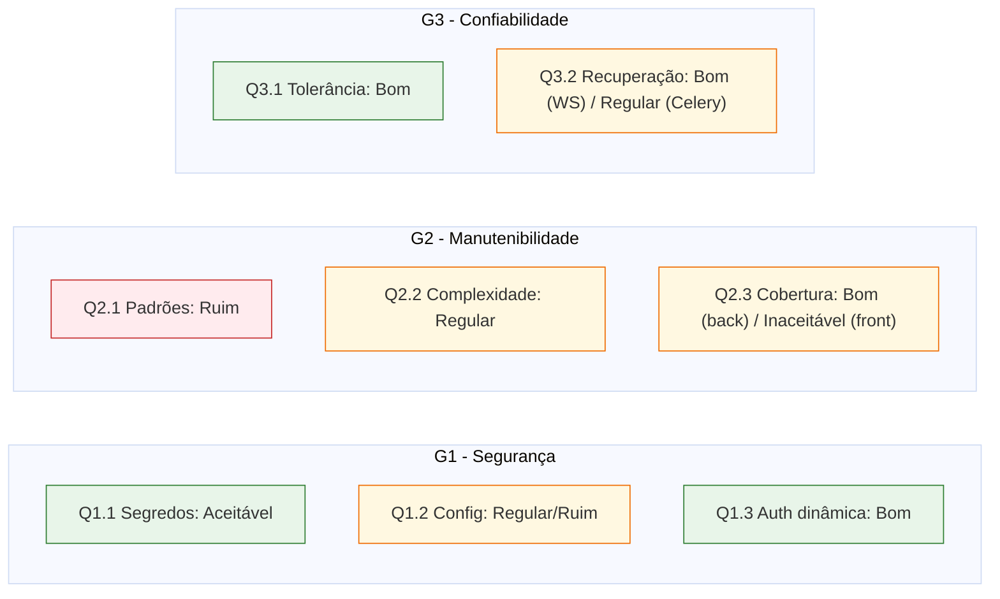

# 3. Análise e Resposta GQM

Esta seção **processa os dados brutos** obtidos na [seção 1](01-medidas.md) e arquivados
na [seção 2](02-dados-brutos.md), **compara cada métrica aos níveis de pontuação e
critérios de julgamento** definidos na [Fase 2, §5](../fase2/05-niveis-pontuacao.md) e,
com isso, **responde às questões (Q)** e **confirma ou refuta as hipóteses (H)**
formuladas na [Fase 2, §3](../fase2/03-hipoteses.md). A estrutura segue a hierarquia GQM
consolidada na [Fase 2, §6](../fase2/06-hierarquia-gqm.md): para cada objetivo (G), suas
questões; para cada questão, suas métricas, o valor medido, o julgamento e o veredito da
hipótese.

!!! info "Escopo desta análise (entrega EU3)"
    Na EU3 as **7 instruções pendentes** da EU2 foram executadas
    ([Fase 4, §1](01-medidas.md)) e a coleta inválida de M2.1.1 (Ruff) foi **recoletada**,
    completando todas as 14 métricas da hierarquia GQM. As tabelas a seguir refletem o
    estado **final** das medições. Todos os dados brutos estão arquivados em
    [`Dados_Brutos/`](02-dados-brutos.md).

## 3.1 Síntese dos resultados

A Tabela 3.1 consolida o resultado de todas as métricas medidas até a EU2, com o
julgamento derivado dos critérios da Fase 2.

**Tabela 3.1: resultado consolidado das métricas.**

| Métrica | Valor medido | Nível (Fase 2, §5) | Julgamento |
|---|---|---|---|
| **M1.1.1** - Segredos confirmados no código-fonte | 0 (2.497 achados de alta entropia do `trufflehog`, todos triados como falsos positivos: bundles JS, `package-lock.json`, docs; **nenhum** em `settings.py`) | 0 | **Aceitável** |
| **M1.1.2** - `.env` ignorado pelo versionamento | Sim (`git ls-files \| grep .env` vazio) | Sim | **Aceitável** |
| **M1.2.1** - Vulnerabilidades Bandit (Média/Alta) | 3 (todas B113 *request_without_timeout*, severidade Média, em `users/views.py`) | 1-3 | **Regular** |
| **M1.2.2** - Conformidade de configuração Django | ~50% (6 itens críticos reprovados: `DEBUG=True`, `SECRET_KEY` fraca, `SECURE_SSL_REDIRECT`, `SESSION_COOKIE_SECURE`, `CSRF_COOKIE_SECURE`, `SECURE_HSTS_SECONDS` ausentes) | < 70% | **Ruim** |
| **M1.3.1** - Atributos do *cookie* de sessão | 0 atributos faltantes (`httponly=True`, `secure=True`, `samesite="Strict"` em `API/users/views.py:517-525`) | 0 | **Bom** |
| **M1.3.2** - Rejeição de JWT manipulado | Válida (HTTP 401 com `"Token is invalid"` para token forjado com chave incorreta) | Válida | **Aceitável** |
| **M2.1.1** - Violações Ruff | 83 (recoletadas na EU3 após invalidação da coleta EU2; predominam PLR6301 *no-self-use* e PLC0415 *import-outside-top-level*) | > 20 | **Ruim** |
| **M2.1.2** - Dependências circulares entre *apps* | 2 ciclos diretos: `chat ↔ users` e `users ↔ reports` (módulo `support` isolado) | > 0 | **Ruim** |
| **M2.2.1** - Complexidade ciclomática média | 2,76 (grau A) sobre 350 blocos | Média < 5 | **Bom** (combinado com M2.2.2) |
| **M2.2.2** - Funções com CC > 10 | 5 (grau C: `UserProfileView`, `UserListView`, `UserProfileView.get`, `UserListView.get`, `ReportViewSet._get_reported_user`) | Contagem(>10) entre 1 e 5 | **Regular** (combinado com M2.2.1) |
| **M2.3.1** - Cobertura de testes (*backend*) | 83% de linhas (sobre 2.389 linhas instrumentadas; 108 de 109 testes aprovados) | > 80% | **Bom** |
| **M2.3.2** - Arquivos de teste (*frontend*) | 0 (sem `*.spec.*` / `*.test.*` em `web/src/`; sem `script` de teste no `package.json`; sem dependências de teste) | 0 | **Inaceitável** |
| **M3.1.1** - Comportamento sob queda do Redis | 4 - degrada graciosamente (REST 200 OK em todos os endpoints testados; sistema retoma sem intervenção após restauração) | 4 | **Bom** |
| **M3.2.1** - Reconexão automática do WebSocket | Sim (`socket.io-client` com *defaults* de reconexão automática habilitados em `web/src/views/Chats.vue` e `Message.vue`) | Sim | **Bom** |
| **M3.2.2** - Política de `retry` no Celery | Não (0 das 13 tarefas com `retry`) | Não | **Regular** |

!!! success "Achado de validade resolvido - M2.1.1 (Ruff)"
    A coleta de M2.1.1 na EU2 produziu arquivo `M2.1.1_ruff_1206.json` com **0 byte**,
    impossibilitando o julgamento. A causa raiz foi identificada na EU3: falha de
    permissão na inicialização do `.ruff_cache` (proveniente de execução anterior em
    contêiner) combinada com redirecionamento de *stderr* que mascarou o erro. A
    recoleta da EU3, com cache limpo e flag `--no-cache`, produziu evidência válida
    (`M2.1.1_ruff_2306.json`, 83 violações, > 20 → nível **Ruim**).

A combinação M2.2.1 (média grau A) com M2.2.2 (5 funções acima do limiar) cai, pelo
critério conjunto da [Fase 2, §5](../fase2/05-niveis-pontuacao.md)
("Média entre 5-10 **ou** Contagem(>10) entre 1 e 5"), no nível **Regular** - e não
"Excelente", como afirmado na coleta inicial. O julgamento corrigido está refletido na
[seção 5](05-julgamento-conclusoes.md).

## 3.2 G1 - Segurança

### Q1.1 - A gestão de segredos está adequadamente protegida?

| Métrica | Valor | Julgamento |
|---|---|---|
| M1.1.1 - segredos confirmados | 0 | Aceitável |
| M1.1.2 - `.env` ignorado | Sim | Aceitável |

**Resposta à Q1.1:** **Sim.** A gestão de segredos está adequadamente protegida quanto à
exposição acidental no versionamento: nenhum segredo confirmado foi encontrado no
código-fonte após triagem dos 2.497 achados de alta entropia do `trufflehog` (todos
ruído de bundles e *lockfiles*), e o arquivo `.env` está corretamente ignorado pelo Git.

**Hipótese H1.1** ("existem segredos, como a `SECRET_KEY`, versionados diretamente em
`settings.py`"): **refutada quanto ao versionamento.** A suspeita inicial da Fase 1 não
se confirmou - não há `SECRET_KEY` *hardcoded* exposta no repositório. Contudo, o
achado de M1.2.2 indica que a `SECRET_KEY` em uso é **fraca / gerada automaticamente**
(provável *fallback* inseguro quando a variável de ambiente está ausente), o que desloca
o risco de "segredo versionado" para "segredo mal gerado" - tratado em Q1.2.

### Q1.2 - As configurações de segurança do framework estão alinhadas com as boas práticas?

| Métrica | Valor | Julgamento |
|---|---|---|
| M1.2.1 - vulnerabilidades Bandit (M/A) | 3 (B113) | Regular |
| M1.2.2 - conformidade Django | ~50% | Ruim |

**Resposta à Q1.2:** **Parcialmente, com lacunas relevantes.** A análise estática do
Bandit aponta apenas 3 vulnerabilidades de severidade Média, todas do mesmo tipo
(requisições HTTP sem *timeout*, B113, em `users/views.py`) - um risco contido e de
correção direta (nível Regular). Porém, o checklist de configuração revela 6 lacunas
críticas de *hardening* para produção (nível Ruim): `DEBUG=True`, `SECRET_KEY` fraca,
e ausência de `SECURE_SSL_REDIRECT`, `SESSION_COOKIE_SECURE`, `CSRF_COOKIE_SECURE` e
`SECURE_HSTS_SECONDS`. A linha de base do framework é razoável, mas a **configuração
específica do AcheiUnB não está endurecida para um ambiente de produção**.

**Hipótese H1.2** ("a configuração padrão do Django oferece boa linha de base, mas
existem lacunas na implementação específica, sobretudo em cabeçalhos de segurança HTTP e
CORS"): **confirmada.** As lacunas previstas materializaram-se exatamente nos cabeçalhos
de segurança (HSTS, SSL *redirect*) e na proteção de *cookies*.

### Q1.3 - O fluxo de autenticação e sessão é seguro?

| Métrica | Valor | Julgamento |
|---|---|---|
| M1.3.1 - atributos do *cookie* | 0 atributos faltantes | Bom |
| M1.3.2 - rejeição de JWT manipulado | Válida | Aceitável |

**Resposta à Q1.3:** **Sim, o fluxo de autenticação e sessão é seguro nos pontos
medidos.** O *cookie* de sessão JWT é emitido com os três atributos críticos
(`HttpOnly`, `Secure`, `SameSite="Strict"`) corretamente configurados, conforme
inspeção do produtor em `API/users/views.py:517-525`. O mecanismo de assinatura JWT
(SimpleJWT, HS256 com `SECRET_KEY` do projeto) rejeita tokens manipulados com `HTTP
401` e mensagem inequívoca de assinatura inválida, sem expor informação sensível.

**Hipótese H1.3** (fluxo de validação funcional, mas *cookies* de sessão possivelmente
pouco restritivos): **parcialmente refutada.** A validação JWT funciona como
esperado (parte confirmada), porém a parte da hipótese sobre *cookies* pouco
restritivos foi **refutada**: na rota de emissão o *cookie* está corretamente
endurecido. O indício de Q1.2 sobre ausência de `SESSION_COOKIE_SECURE` no
`settings.py` afeta o *cookie* de sessão do framework Django (admin, CSRF) mas
**não** o *cookie* JWT específico do AcheiUnB, que é configurado diretamente no
*view*.

## 3.3 G2 - Manutenibilidade

### Q2.1 - O código segue padrões e é modular?

| Métrica | Valor | Julgamento |
|---|---|---|
| M2.1.1 - violações Ruff | 83 | Ruim |
| M2.1.2 - dependências circulares | 2 (`chat↔users`, `users↔reports`) | Ruim |

**Resposta à Q2.1:** **Não nas duas dimensões medidas.** O *backend* apresenta **83
violações Ruff** ativas (predominantemente PLR6301 *no-self-use* e PLC0415
*import-outside-top-level*), o que sinaliza inconsistência sistêmica de padrões e
torna a leitura/contribuição mais custosa. A inspeção de *imports* entre os módulos
Django identificou **2 ciclos diretos** (`chat ↔ users` e `users ↔ reports`); o
módulo `support` é o único totalmente desacoplado. O resultado conjunto fica no
nível **Ruim**.

**Hipótese H2.1** (alta conformidade com Black/Ruff, mas possível acoplamento
circular entre *apps*): **parcialmente confirmada e parcialmente refutada.** A parte
do acoplamento foi **confirmada** (os ciclos esperados em `chat`/`users` apareceram
e o ciclo `users`/`reports` se somou). Já a parte da conformidade com Ruff foi
**refutada**: a expectativa de "alta conformidade" não se sustentou com 83 violações
ativas. A invalidação da coleta original na EU2 mascarou esse resultado e foi
corrigida na recoleta da EU3.

### Q2.2 - Qual o nível de complexidade do código?

| Métrica | Valor | Julgamento |
|---|---|---|
| M2.2.1 - complexidade média | 2,76 (grau A) | combinado → Regular |
| M2.2.2 - funções com CC > 10 | 5 (grau C) | combinado → Regular |

**Resposta à Q2.2:** **Boa na média, com pontos localizados de atenção.** O código é
majoritariamente simples (média 2,76, grau A, sobre 350 blocos), mas existem **5 pontos
de complexidade elevada** concentrados no módulo `users` (`UserProfileView`,
`UserListView` e seus métodos `get`) e um em `reports`
(`ReportViewSet._get_reported_user`). Pelo critério conjunto da Fase 2, o resultado é
**Regular** - há débito técnico pontual, e esses são exatamente os candidatos
prioritários a refatoração para a decisão D1.

**Hipótese H2.2** ("a maioria do código terá baixa complexidade, mas módulos com lógica
mais densa, como `users`, apresentarão funções de complexidade elevada"):
**confirmada.** A previsão acertou inclusive o módulo: 4 dos 5 pontos críticos estão em
`users`.

### Q2.3 - A cobertura de testes é suficiente?

| Métrica | Valor | Julgamento |
|---|---|---|
| M2.3.1 - cobertura (*backend*) | 83% | Bom |
| M2.3.2 - testes no *frontend* | 0 | Inaceitável |

**Resposta à Q2.3:** **Assimétrica: suficiente no *backend*, inexistente no
*frontend*.** A suíte de testes do *backend* atinge **83% de cobertura de linhas**
(2.389 linhas instrumentadas; 108 de 109 testes aprovados), acima do limiar de 80%
estabelecido na Fase 2 §5 (nível **Bom**). O *frontend*, em contrapartida, **não
possui infraestrutura de testes**: não há arquivos `*.spec.*` ou `*.test.*` em
`web/src/`, nem `script` de teste em `web/package.json`, nem dependências de teste
declaradas (sem `vitest`, `jest`, `@testing-library/*`). O resultado para o
*frontend* é **Inaceitável**.

**Hipótese H2.3** (cobertura intermediária de 60-80% no *backend*; ausência total de
testes no *frontend*): **parcialmente confirmada e parcialmente refutada.** A
previsão sobre o *frontend* foi **confirmada integralmente** (0 testes). Já a
previsão sobre o *backend* foi **superada**: a cobertura medida (83%) está acima da
faixa esperada de 60-80%, situando-se já no nível **Bom**.

## 3.4 G3 - Confiabilidade

### Q3.1 - O sistema é tolerante a falhas em serviços externos?

| Métrica | Valor | Julgamento |
|---|---|---|
| M3.1.1 - comportamento sob queda do Redis | 4 (degrada graciosamente) | Bom |

**Resposta à Q3.1:** **Sim, o sistema demonstra resiliência frente à falha do Redis.**
No ensaio executado (`docker compose stop redis` por 3 minutos com sondagem de
endpoints REST), todos os endpoints testados (`/api/items/`, `/api/categories/`,
`/api/locations/`, `/api/brands/`, `/admin/login/`) responderam **HTTP 200 OK**.
Nenhuma exceção do Django foi observada nos *logs*, nenhuma resposta HTTP 500 foi
emitida e o sistema retomou ao estado normal após `docker compose start redis` sem
intervenção. A funcionalidade de chat (Channels com *layer* no Redis) fica
temporariamente indisponível, mas isso **não derruba** a API REST. O comportamento
cai no nível **4 (degrada graciosamente)** da Tabela 5.12, julgamento **Bom**.

**Hipótese H3.1** (falha no Redis interrompe imediatamente chat e *matching*, sem
*fallback*): **parcialmente confirmada e parcialmente refutada.** A parte de
"interrompe chat e *matching*" foi confirmada (essas funcionalidades dependem do
Redis e ficam indisponíveis). Já o "sem *fallback*" foi **refutado** no sentido
sistêmico: o restante do sistema continua operando, o que caracteriza um *fallback*
implícito por isolamento de falha.

### Q3.2 - O sistema se recupera de falhas de conexão ou de tarefas?

| Métrica | Valor | Julgamento |
|---|---|---|
| M3.2.1 - reconexão do WebSocket | Sim | Bom |
| M3.2.2 - `retry` no Celery | Não (0/13 tarefas) | Regular |

**Resposta à Q3.2:** **Recupera no canal de tempo real, não recupera nas tarefas
assíncronas.** Do lado do *frontend*, a conexão de chat é estabelecida via
`socket.io-client` com os *defaults* da biblioteca preservados
(`reconnection=true`, *backoff* exponencial), o que garante reconexão automática
após interrupção breve de rede ou *restart* do serviço, atingindo nível **Bom** para
M3.2.1. Do lado do *backend*, nenhuma das **13 tarefas Celery** mapeadas em `chat`
e `users` possui política de `retry` (`autoretry_for`, `retry_backoff`, `max_retries`
ou tratamento explícito de exceção com reenfileiramento), o que expõe o sistema à
perda de execução sob falhas transitórias e mantém M3.2.2 em **Regular**.

**Hipótese H3.2** (nem WebSocket nem Celery possuem *retry*/reconexão automática por
padrão): **parcialmente refutada.** A parte do Celery foi **confirmada** (0 de 13
tarefas com *retry*). A parte do WebSocket foi **refutada**: a reconexão automática
está habilitada por padrão da biblioteca e não foi desabilitada pelo código do
AcheiUnB.

## 3.5 Visão consolidada por característica

O gráfico a seguir resume o estado de cada característica priorizada considerando apenas
as métricas já medidas, em uma escala de julgamento Ruim → Regular → Bom/Aceitável.

*Figura 3.1: panorama final das respostas GQM na EU3. Verde = Bom/Aceitável;
amarelo = atenção (Regular ou resultado misto); vermelho = Ruim em ambas as
métricas da questão.*

**Tabela 3.2: contagem de questões por nível de julgamento agregado.**

| Nível agregado | Questões | Total |
|---|---|---|
| Bom / Aceitável (todas as métricas da questão) | Q1.1, Q1.3, Q3.1 | 3 |
| Resultado misto (parcialmente Bom, parcialmente Regular/Ruim) | Q1.2, Q2.2, Q2.3, Q3.2 | 4 |
| Ruim (todas as métricas da questão no nível Ruim) | Q2.1 | 1 |

Em comparação com o panorama da EU2 (4 respondidas, 4 indeterminadas), a EU3
elimina as pendências e revela uma assimetria interna ao G2 (Manutenibilidade):
forte no *backend* (cobertura, complexidade média) e frágil em padrões de código
(Ruff e ciclos) e no *frontend* (zero testes). A coerência desses resultados com o
propósito declarado é discutida na [seção 4](04-coerencia-resultados.md), e o
julgamento final, com sugestões de melhoria, na
[seção 5](05-julgamento-conclusoes.md).

## Histórico de versão

| Versão | Data       | Descrição | Autor(es) | Revisor(es) |
| :-- | :-- | :-- | :-- | :-- |
| 1.0 | 2026-06-12 | Tabela de rastreabilidade questão-métrica (sem análise dos valores). | Samuel Afonso | Davi Casseb, Letícia Hladczuk |
| 2.0 | 2026-06-12 | Análise completa: valores medidos, comparação com os níveis de pontuação da Fase 2, respostas às questões, veredito das hipóteses e visão consolidada. | Samuel Afonso | Davi Casseb, Letícia Hladczuk |
| 3.0 | 2026-06-23 | Atualização para a EU3: incorporação dos resultados das 7 instruções recoletadas e da recoleta válida de M2.1.1, revisão das respostas Q1.3/Q2.1/Q2.3/Q3.1/Q3.2 e atualização do panorama consolidado. | Luis Eduardo Castro M Lima, Ana Joyce Guedes | Julia Vitória |

## Referências

1. ISO/IEC 25040:2011. *Systems and software engineering: Systems and software Quality Requirements and Evaluation (SQuaRE): Evaluation process*. International Organization for Standardization, 2011.
2. BASILI, Victor R.; CALDIERA, Gianluigi; ROMBACH, H. Dieter. *The Goal Question Metric Approach*. In: Encyclopedia of Software Engineering. Wiley, 1994.
3. Django Software Foundation. *Deployment checklist e Security in Django*. Disponível em: <https://docs.djangoproject.com/en/5.1/howto/deployment/checklist/>. Acesso em: 12 jun. 2026.
4. PyCQA. *Bandit Documentation*. Disponível em: <https://bandit.readthedocs.io/>. Acesso em: 12 jun. 2026.
5. Radon. *Radon Documentation: Cyclomatic Complexity*. Disponível em: <https://radon.readthedocs.io/>. Acesso em: 12 jun. 2026.