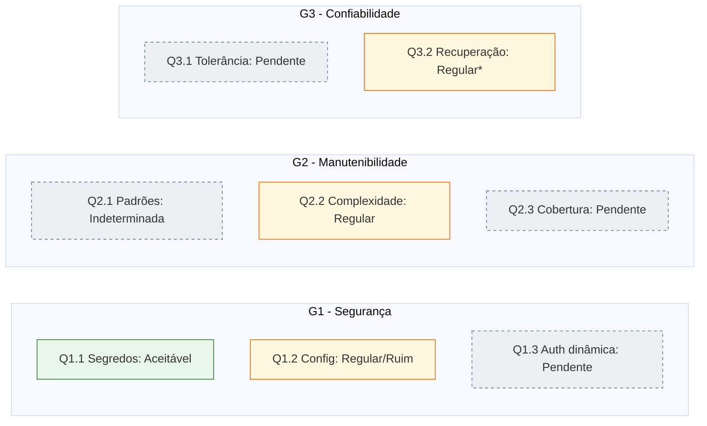

# 3. Análise e Resposta GQM

Esta seção **processa os dados brutos** obtidos na [seção 1](01-medidas.md) e arquivados
na [seção 2](02-dados-brutos.md), **compara cada métrica aos níveis de pontuação e
critérios de julgamento** definidos na [Fase 2, §5](../fase2/05-niveis-pontuacao.md) e,
com isso, **responde às questões (Q)** e **confirma ou refuta as hipóteses (H)**
formuladas na [Fase 2, §3](../fase2/03-hipoteses.md). A estrutura segue a hierarquia GQM
consolidada na [Fase 2, §6](../fase2/06-hierarquia-gqm.md): para cada objetivo (G), suas
questões; para cada questão, suas métricas, o valor medido, o julgamento e o veredito da
hipótese.

!!! info "Escopo desta análise (entrega EU2)"
    Sete instruções de coleta permanecem pendentes ([Fase 4, Tabela 4.1](index.md#estado-da-execucao));
    as métricas correspondentes aparecem nas tabelas com valor **"Pendente"** e as
    questões afetadas (Q1.3, Q2.3, Q3.1) têm resposta **parcial**, explicitamente
    sinalizada. Essa transparência atende ao princípio de cortes declarados da
    [Fase 1, §6.3](../fase1/06-escopo.md#63-fora-do-escopo).

## 3.1 Síntese dos resultados

A Tabela 3.1 consolida o resultado de todas as métricas medidas até a EU2, com o
julgamento derivado dos critérios da Fase 2.

**Tabela 3.1: resultado consolidado das métricas.**

| Métrica | Valor medido | Nível (Fase 2, §5) | Julgamento |
|---|---|---|---|
| **M1.1.1** - Segredos confirmados no código-fonte | 0 (2.497 achados de alta entropia do `trufflehog`, todos triados como falsos positivos: bundles JS, `package-lock.json`, docs; **nenhum** em `settings.py`) | 0 | **Aceitável** |
| **M1.1.2** - `.env` ignorado pelo versionamento | Sim (`git ls-files \| grep .env` vazio) | Sim | **Aceitável** |
| **M1.2.1** - Vulnerabilidades Bandit (Média/Alta) | 3 (todas B113 *request_without_timeout*, severidade Média, em `users/views.py`) | 1-3 | **Regular** |
| **M1.2.2** - Conformidade de configuração Django | ~50% (6 itens críticos reprovados: `DEBUG=True`, `SECRET_KEY` fraca, `SECURE_SSL_REDIRECT`, `SESSION_COOKIE_SECURE`, `CSRF_COOKIE_SECURE`, `SECURE_HSTS_SECONDS` ausentes) | < 70% | **Ruim** |
| **M1.3.1** - Atributos do *cookie* de sessão | Pendente (I-05) | - | Pendente |
| **M1.3.2** - Rejeição de JWT manipulado | Pendente (I-06) | - | Pendente |
| **M2.1.1** - Violações Ruff | Coleta inválida (arquivo de log com 0 byte; ver nota abaixo) | - | A refazer |
| **M2.1.2** - Dependências circulares entre *apps* | Pendente (I-08) | - | Pendente |
| **M2.2.1** - Complexidade ciclomática média | 2,76 (grau A) sobre 350 blocos | Média < 5 | **Bom** (combinado com M2.2.2) |
| **M2.2.2** - Funções com CC > 10 | 5 (grau C: `UserProfileView`, `UserListView`, `UserProfileView.get`, `UserListView.get`, `ReportViewSet._get_reported_user`) | Contagem(>10) entre 1 e 5 | **Regular** (combinado com M2.2.1) |
| **M2.3.1** - Cobertura de testes (*backend*) | Pendente (I-10) | - | Pendente |
| **M2.3.2** - Arquivos de teste (*frontend*) | Pendente (I-11) | - | Pendente |
| **M3.1.1** - Comportamento sob queda do Redis | Pendente (I-12) | - | Pendente |
| **M3.2.1** - Reconexão automática do WebSocket | Pendente (I-13) | - | Pendente |
| **M3.2.2** - Política de `retry` no Celery | Não (0 das 13 tarefas com `retry`) | Não | **Regular** |

!!! warning "Achado de validade - M2.1.1 (Ruff)"
    O arquivo `M2.1.1_ruff_1206.json` foi gravado com **0 byte**. Uma execução do Ruff
    sem violações produz uma lista JSON vazia (`[]`, 2 bytes), nunca um arquivo vazio;
    portanto, o resultado "nenhuma violação" reportado na [seção 1](01-medidas.md)
    **não é sustentado pela evidência** e a métrica deve ser **recoletada** (regra de
    dupla execução, [Fase 3, §1.2](../fase3/01-metodo-instrucoes.md#12-regras-gerais-de-execucao-validas-para-todas-as-instrucoes)).
    Até a recoleta, M2.1.1 **não** é usada para responder Q2.1 nem para sustentar
    qualquer julgamento.

A combinação M2.2.1 (média grau A) com M2.2.2 (5 funções acima do limiar) cai, pelo
critério conjunto da [Fase 2, §5](../fase2/05-niveis-pontuacao.md)
("Média entre 5-10 **ou** Contagem(>10) entre 1 e 5"), no nível **Regular** - e não
"Excelente", como afirmado na coleta inicial. O julgamento corrigido está refletido na
[seção 5](05-julgamento-conclusoes.md).

## 3.2 G1 - Segurança

### Q1.1 - A gestão de segredos está adequadamente protegida?

| Métrica | Valor | Julgamento |
|---|---|---|
| M1.1.1 - segredos confirmados | 0 | Aceitável |
| M1.1.2 - `.env` ignorado | Sim | Aceitável |

**Resposta à Q1.1:** **Sim.** A gestão de segredos está adequadamente protegida quanto à
exposição acidental no versionamento: nenhum segredo confirmado foi encontrado no
código-fonte após triagem dos 2.497 achados de alta entropia do `trufflehog` (todos
ruído de bundles e *lockfiles*), e o arquivo `.env` está corretamente ignorado pelo Git.

**Hipótese H1.1** ("existem segredos, como a `SECRET_KEY`, versionados diretamente em
`settings.py`"): **refutada quanto ao versionamento.** A suspeita inicial da Fase 1 não
se confirmou - não há `SECRET_KEY` *hardcoded* exposta no repositório. Contudo, o
achado de M1.2.2 indica que a `SECRET_KEY` em uso é **fraca / gerada automaticamente**
(provável *fallback* inseguro quando a variável de ambiente está ausente), o que desloca
o risco de "segredo versionado" para "segredo mal gerado" - tratado em Q1.2.

### Q1.2 - As configurações de segurança do framework estão alinhadas com as boas práticas?

| Métrica | Valor | Julgamento |
|---|---|---|
| M1.2.1 - vulnerabilidades Bandit (M/A) | 3 (B113) | Regular |
| M1.2.2 - conformidade Django | ~50% | Ruim |

**Resposta à Q1.2:** **Parcialmente, com lacunas relevantes.** A análise estática do
Bandit aponta apenas 3 vulnerabilidades de severidade Média, todas do mesmo tipo
(requisições HTTP sem *timeout*, B113, em `users/views.py`) - um risco contido e de
correção direta (nível Regular). Porém, o checklist de configuração revela 6 lacunas
críticas de *hardening* para produção (nível Ruim): `DEBUG=True`, `SECRET_KEY` fraca,
e ausência de `SECURE_SSL_REDIRECT`, `SESSION_COOKIE_SECURE`, `CSRF_COOKIE_SECURE` e
`SECURE_HSTS_SECONDS`. A linha de base do framework é razoável, mas a **configuração
específica do AcheiUnB não está endurecida para um ambiente de produção**.

**Hipótese H1.2** ("a configuração padrão do Django oferece boa linha de base, mas
existem lacunas na implementação específica, sobretudo em cabeçalhos de segurança HTTP e
CORS"): **confirmada.** As lacunas previstas materializaram-se exatamente nos cabeçalhos
de segurança (HSTS, SSL *redirect*) e na proteção de *cookies*.

### Q1.3 - O fluxo de autenticação e sessão é seguro?

| Métrica | Valor | Julgamento |
|---|---|---|
| M1.3.1 - atributos do *cookie* | Pendente (I-05) | - |
| M1.3.2 - rejeição de JWT manipulado | Pendente (I-06) | - |

**Resposta à Q1.3:** **Indeterminada nesta entrega.** Ambas as métricas dependem de
ensaio dinâmico (MA3) ainda não executado. Observa-se, como indício prévio derivado de
M1.2.2, que a ausência de `SESSION_COOKIE_SECURE` tende a reduzir a proteção do *cookie*
de sessão, o que deverá ser confirmado por M1.3.1. A resposta definitiva fica
condicionada à conclusão de I-05 e I-06.

**Hipótese H1.3** (fluxo de validação funcional, mas *cookies* de sessão possivelmente
pouco restritivos): **ainda não testável**; o indício de M1.2.2 é coerente com a
hipótese, mas a confirmação exige os dados pendentes.

## 3.3 G2 - Manutenibilidade

### Q2.1 - O código segue padrões e é modular?

| Métrica | Valor | Julgamento |
|---|---|---|
| M2.1.1 - violações Ruff | Coleta inválida (0 byte) | A refazer |
| M2.1.2 - dependências circulares | Pendente (I-08) | - |

**Resposta à Q2.1:** **Indeterminada nesta entrega.** A evidência do Ruff é inválida
(arquivo vazio) e o mapa de dependências (I-08) não foi gerado. Portanto, **não** é
possível afirmar conformidade de estilo nem ausência de acoplamento circular com base em
dados auditáveis. Esta questão é repriorizada para recoleta.

**Hipótese H2.1** (alta conformidade com Black/Ruff, mas possível acoplamento circular
entre *apps*): **não testável** com os dados atuais - a parte do Ruff carece de evidência
válida e a parte de acoplamento não foi medida.

### Q2.2 - Qual o nível de complexidade do código?

| Métrica | Valor | Julgamento |
|---|---|---|
| M2.2.1 - complexidade média | 2,76 (grau A) | combinado → Regular |
| M2.2.2 - funções com CC > 10 | 5 (grau C) | combinado → Regular |

**Resposta à Q2.2:** **Boa na média, com pontos localizados de atenção.** O código é
majoritariamente simples (média 2,76, grau A, sobre 350 blocos), mas existem **5 pontos
de complexidade elevada** concentrados no módulo `users` (`UserProfileView`,
`UserListView` e seus métodos `get`) e um em `reports`
(`ReportViewSet._get_reported_user`). Pelo critério conjunto da Fase 2, o resultado é
**Regular** - há débito técnico pontual, e esses são exatamente os candidatos
prioritários a refatoração para a decisão D1.

**Hipótese H2.2** ("a maioria do código terá baixa complexidade, mas módulos com lógica
mais densa, como `users`, apresentarão funções de complexidade elevada"):
**confirmada.** A previsão acertou inclusive o módulo: 4 dos 5 pontos críticos estão em
`users`.

### Q2.3 - A cobertura de testes é suficiente?

| Métrica | Valor | Julgamento |
|---|---|---|
| M2.3.1 - cobertura (*backend*) | Pendente (I-10) | - |
| M2.3.2 - testes no *frontend* | Pendente (I-11) | - |

**Resposta à Q2.3:** **Indeterminada nesta entrega.** Ambas as métricas estão pendentes.
A [Fase 1, §3.3.3](../fase1/03-software.md#333-frontend) já registrara, por inspeção
preliminar, a aparente ausência de testes automatizados no *frontend*, o que antecipa um
resultado desfavorável para M2.3.2, mas a confirmação formal depende de I-11.

**Hipótese H2.3** (cobertura intermediária de 60-80% no *backend*; ausência total de
testes no *frontend*): **ainda não testável**; aguarda I-10 e I-11.

## 3.4 G3 - Confiabilidade

### Q3.1 - O sistema é tolerante a falhas em serviços externos?

| Métrica | Valor | Julgamento |
|---|---|---|
| M3.1.1 - comportamento sob queda do Redis | Pendente (I-12) | - |

**Resposta à Q3.1:** **Indeterminada nesta entrega.** O cenário de queda do Redis (I-12)
é um ensaio dinâmico (MA3) ainda não executado. A resposta fica condicionada à sua
conclusão.

**Hipótese H3.1** (falha no Redis interrompe imediatamente chat e *matching*, sem
*fallback*): **ainda não testável**.

### Q3.2 - O sistema se recupera de falhas de conexão ou de tarefas?

| Métrica | Valor | Julgamento |
|---|---|---|
| M3.2.1 - reconexão do WebSocket | Pendente (I-13) | - |
| M3.2.2 - `retry` no Celery | Não (0/13 tarefas) | Regular |

**Resposta à Q3.2:** **Parcialmente - lado das tarefas assíncronas confirmado como
frágil.** Nenhuma das 13 tarefas Celery (`@shared_task` em `chat` e `users`) possui
política de `retry`, o que expõe o sistema à perda de execução sob falhas transitórias
(nível Regular). A capacidade de reconexão do WebSocket (M3.2.1) permanece pendente, de
modo que a resposta cobre apenas a metade relativa ao Celery.

**Hipótese H3.2** (nem WebSocket nem Celery possuem *retry*/reconexão automática por
padrão): **confirmada para o Celery** (0 de 13 tarefas com *retry*); a parte do
WebSocket aguarda I-13.

## 3.5 Visão consolidada por característica

O gráfico a seguir resume o estado de cada característica priorizada considerando apenas
as métricas já medidas, em uma escala de julgamento Ruim → Regular → Bom/Aceitável.

*Figura 3.1: panorama das respostas GQM na EU2. Verde = aceitável; amarelo = atenção
(Regular/Ruim); cinza tracejado = pendente de coleta. (*) Q3.2 julgada apenas pela
parte do Celery.*

**Tabela 3.2: contagem de questões por estado de resposta.**

| Estado | Questões | Total |
|---|---|---|
| Respondida (dados suficientes) | Q1.1, Q1.2, Q2.2, Q3.2 (parcial) | 4 |
| Indeterminada / pendente | Q1.3, Q2.1, Q2.3, Q3.1 | 4 |

As quatro questões respondidas concentram-se nas características de maior prioridade
(Segurança P1 e Manutenibilidade P2), em coerência com a estratégia de cobertura
progressiva da [Fase 1, §6.4](../fase1/06-escopo.md#64-plano-de-cobertura-progressiva).
A coerência desses resultados com o propósito declarado é discutida na
[seção 4](04-coerencia-resultados.md), e o julgamento final, com sugestões de melhoria,
na [seção 5](05-julgamento-conclusoes.md).

## Histórico de versão

| Versão | Data       | Descrição | Autor(es) | Revisor(es) |
| :-- | :-- | :-- | :-- | :-- |
| 1.0 | 2026-06-12 | Tabela de rastreabilidade questão-métrica (sem análise dos valores). | Samuel Afonso | Davi Casseb, Letícia Hladczuk |
| 2.0 | 2026-06-12 | Análise completa: valores medidos, comparação com os níveis de pontuação da Fase 2, respostas às questões, veredito das hipóteses e visão consolidada. | Samuel Afonso | Davi Casseb, Letícia Hladczuk |

## Referências

1. ISO/IEC 25040:2011. *Systems and software engineering: Systems and software Quality Requirements and Evaluation (SQuaRE): Evaluation process*. International Organization for Standardization, 2011.
2. BASILI, Victor R.; CALDIERA, Gianluigi; ROMBACH, H. Dieter. *The Goal Question Metric Approach*. In: Encyclopedia of Software Engineering. Wiley, 1994.
3. Django Software Foundation. *Deployment checklist e Security in Django*. Disponível em: <https://docs.djangoproject.com/en/5.1/howto/deployment/checklist/>. Acesso em: 12 jun. 2026.
4. PyCQA. *Bandit Documentation*. Disponível em: <https://bandit.readthedocs.io/>. Acesso em: 12 jun. 2026.
5. Radon. *Radon Documentation: Cyclomatic Complexity*. Disponível em: <https://radon.readthedocs.io/>. Acesso em: 12 jun. 2026.